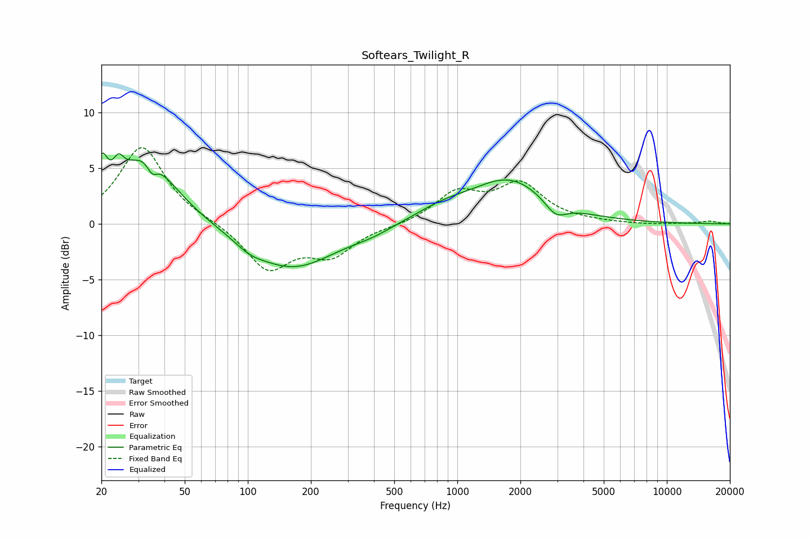

# Softears_Twilight_R
See [usage instructions](https://github.com/jaakkopasanen/AutoEq#usage) for more options and info.

### Parametric EQs
Apply preamp of -6.5 dB when using parametric equalizer.

|   # | Type    |   Fc (Hz) |    Q |   Gain (dB) |
|-----|---------|-----------|------|-------------|
|   1 | Peaking |        20 | 5.5  |         3.2 |
|   2 | Peaking |        24 | 5.84 |         1.6 |
|   3 | Peaking |        32 | 1.04 |         6.1 |
|   4 | Peaking |        35 | 5.89 |        -1.1 |
|   5 | Peaking |       102 | 2.11 |        -0.6 |
|   6 | Peaking |       162 | 0.68 |        -4   |
|   7 | Peaking |       393 | 1.43 |        -0.4 |
|   8 | Peaking |       851 | 0.98 |         1   |
|   9 | Peaking |      1782 | 0.78 |         3.9 |
|  10 | Peaking |      2947 | 2.64 |        -1.4 |

### Fixed Band EQs
When using fixed band (also called graphic) equalizer, apply preamp of **-6.9 dB** (if available) and set gains manually with these parameters.

|   # | Type    |   Fc (Hz) |    Q |   Gain (dB) |
|-----|---------|-----------|------|-------------|
|   1 | Peaking |        31 | 1.41 |         7   |
|   2 | Peaking |        62 | 1.41 |         0.2 |
|   3 | Peaking |       125 | 1.41 |        -4   |
|   4 | Peaking |       250 | 1.41 |        -2.6 |
|   5 | Peaking |       500 | 1.41 |        -0.2 |
|   6 | Peaking |      1000 | 1.41 |         2.7 |
|   7 | Peaking |      2000 | 1.41 |         3.4 |
|   8 | Peaking |      4000 | 1.41 |         0.1 |
|   9 | Peaking |      8000 | 1.41 |        -0.1 |
|  10 | Peaking |     16000 | 1.41 |         0.2 |

### Graphs

