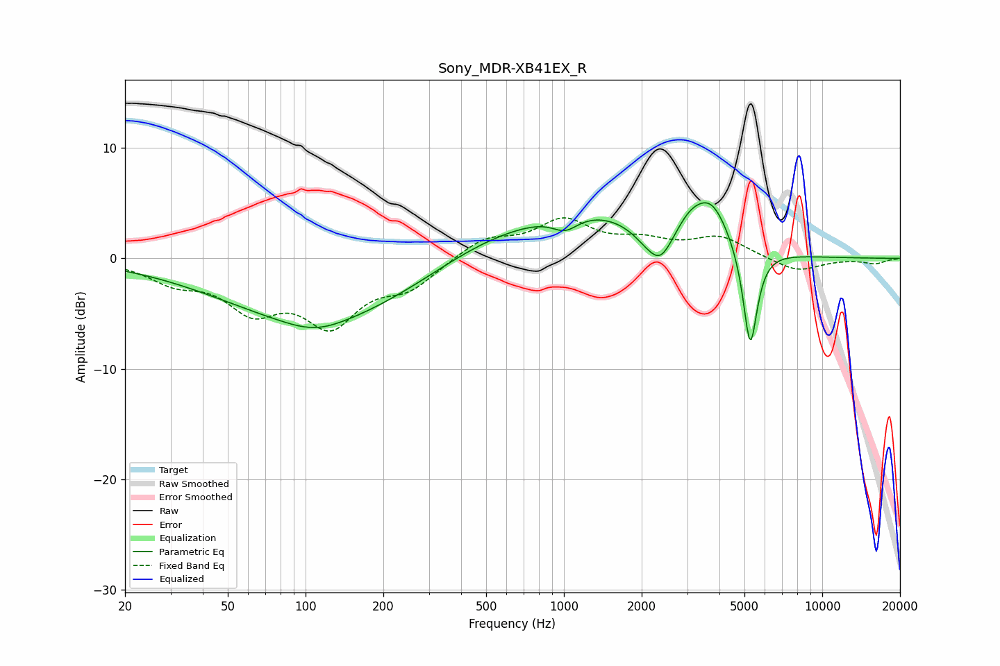

# Sony_MDR-XB41EX_R
See [usage instructions](https://github.com/jaakkopasanen/AutoEq#usage) for more options and info.

### Parametric EQs
Apply preamp of -5.1 dB when using parametric equalizer.

|   # | Type    |   Fc (Hz) |    Q |   Gain (dB) |
|-----|---------|-----------|------|-------------|
|   1 | Peaking |       109 | 1.24 |        -0.9 |
|   2 | Peaking |       115 | 0.36 |        -5.6 |
|   3 | Peaking |       476 | 0.61 |         1.6 |
|   4 | Peaking |      1013 | 2.74 |        -1.4 |
|   5 | Peaking |      1263 | 0.53 |         3.9 |
|   6 | Peaking |      2076 | 2.31 |        -1   |
|   7 | Peaking |      2369 | 2.81 |        -2.8 |
|   8 | Peaking |      3085 | 2.41 |         1.6 |
|   9 | Peaking |      3744 | 2.03 |         3.8 |
|  10 | Peaking |      5264 | 5.03 |        -9.3 |

### Fixed Band EQs
When using fixed band (also called graphic) equalizer, apply preamp of **-3.8 dB** (if available) and set gains manually with these parameters.

|   # | Type    |   Fc (Hz) |    Q |   Gain (dB) |
|-----|---------|-----------|------|-------------|
|   1 | Peaking |        31 | 1.41 |        -1.8 |
|   2 | Peaking |        62 | 1.41 |        -4.1 |
|   3 | Peaking |       125 | 1.41 |        -5.4 |
|   4 | Peaking |       250 | 1.41 |        -2.3 |
|   5 | Peaking |       500 | 1.41 |         1.8 |
|   6 | Peaking |      1000 | 1.41 |         3.2 |
|   7 | Peaking |      2000 | 1.41 |         1.3 |
|   8 | Peaking |      4000 | 1.41 |         1.8 |
|   9 | Peaking |      8000 | 1.41 |        -1.3 |
|  10 | Peaking |     16000 | 1.41 |        -0.5 |

### Graphs

