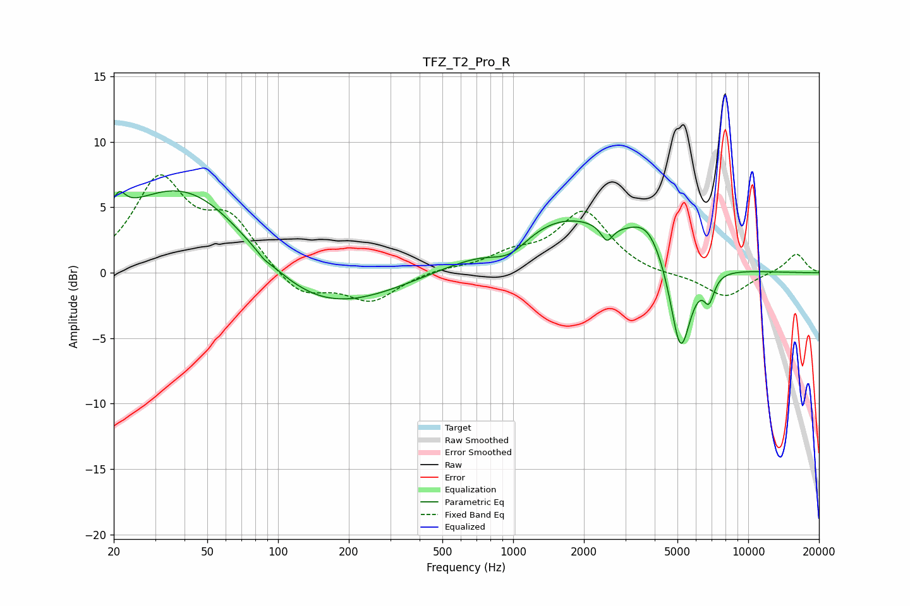

# TFZ_T2_Pro_R
See [usage instructions](https://github.com/jaakkopasanen/AutoEq#usage) for more options and info.

### Parametric EQs
Apply preamp of -6.4 dB when using parametric equalizer.

|   # | Type    |   Fc (Hz) |    Q |   Gain (dB) |
|-----|---------|-----------|------|-------------|
|   1 | Peaking |        21 | 5.09 |         1.5 |
|   2 | Peaking |        43 | 0.45 |         7.8 |
|   3 | Peaking |        87 | 5.84 |        -0.2 |
|   4 | Peaking |       129 | 0.45 |        -4.6 |
|   5 | Peaking |       967 | 1.63 |        -1.7 |
|   6 | Peaking |      1586 | 0.5  |         4.4 |
|   7 | Peaking |      2505 | 5.68 |        -1.3 |
|   8 | Peaking |      3742 | 1.87 |         2.3 |
|   9 | Peaking |      5148 | 3.14 |        -7.4 |
|  10 | Peaking |      6808 | 6    |        -1.9 |

### Fixed Band EQs
When using fixed band (also called graphic) equalizer, apply preamp of **-7.6 dB** (if available) and set gains manually with these parameters.

|   # | Type    |   Fc (Hz) |    Q |   Gain (dB) |
|-----|---------|-----------|------|-------------|
|   1 | Peaking |        31 | 1.41 |         6.9 |
|   2 | Peaking |        62 | 1.41 |         3.7 |
|   3 | Peaking |       125 | 1.41 |        -1.9 |
|   4 | Peaking |       250 | 1.41 |        -2.1 |
|   5 | Peaking |       500 | 1.41 |         0.3 |
|   6 | Peaking |      1000 | 1.41 |         1.2 |
|   7 | Peaking |      2000 | 1.41 |         4.6 |
|   8 | Peaking |      4000 | 1.41 |        -0.3 |
|   9 | Peaking |      8000 | 1.41 |        -1.9 |
|  10 | Peaking |     16000 | 1.41 |         1.5 |

### Graphs

