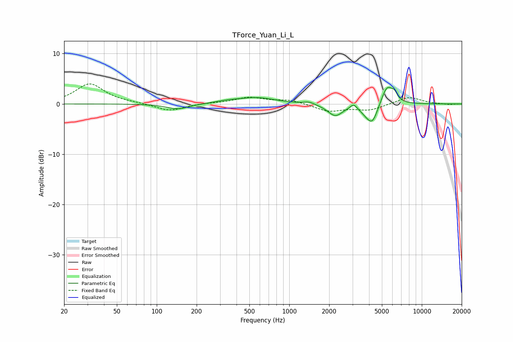

# TForce_Yuan_Li_L
See [usage instructions](https://github.com/jaakkopasanen/AutoEq#usage) for more options and info.

### Parametric EQs
Apply preamp of -3.4 dB when using parametric equalizer.

|   # | Type    |   Fc (Hz) |    Q |   Gain (dB) |
|-----|---------|-----------|------|-------------|
|   1 | Peaking |       144 | 1.68 |        -1.1 |
|   2 | Peaking |       339 | 1.58 |         0.3 |
|   3 | Peaking |       564 | 1.01 |         1.2 |
|   4 | Peaking |      1410 | 3.62 |         0.5 |
|   5 | Peaking |      2221 | 2.5  |        -2.3 |
|   6 | Peaking |      3059 | 6    |         1   |
|   7 | Peaking |      3781 | 3.09 |        -1.1 |
|   8 | Peaking |      4243 | 3.46 |        -3.5 |
|   9 | Peaking |      5473 | 3.23 |         3.8 |
|  10 | Peaking |      6214 | 6    |         1.3 |

### Fixed Band EQs
When using fixed band (also called graphic) equalizer, apply preamp of **-4.1 dB** (if available) and set gains manually with these parameters.

|   # | Type    |   Fc (Hz) |    Q |   Gain (dB) |
|-----|---------|-----------|------|-------------|
|   1 | Peaking |        31 | 1.41 |         4   |
|   2 | Peaking |        62 | 1.41 |         0.2 |
|   3 | Peaking |       125 | 1.41 |        -1.4 |
|   4 | Peaking |       250 | 1.41 |         0.1 |
|   5 | Peaking |       500 | 1.41 |         1.3 |
|   6 | Peaking |      1000 | 1.41 |         0.8 |
|   7 | Peaking |      2000 | 1.41 |        -1.5 |
|   8 | Peaking |      4000 | 1.41 |        -1.2 |
|   9 | Peaking |      8000 | 1.41 |         1.4 |
|  10 | Peaking |     16000 | 1.41 |        -0.1 |

### Graphs

