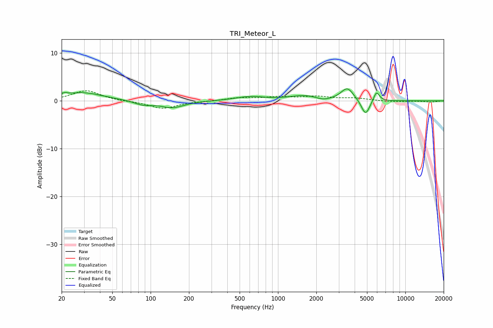

# TRI_Meteor_L
See [usage instructions](https://github.com/jaakkopasanen/AutoEq#usage) for more options and info.

### Parametric EQs
Apply preamp of -2.6 dB when using parametric equalizer.

|   # | Type    |   Fc (Hz) |    Q |   Gain (dB) |
|-----|---------|-----------|------|-------------|
|   1 | Peaking |        21 | 5.49 |         0.5 |
|   2 | Peaking |        29 | 0.91 |         1.7 |
|   3 | Peaking |        87 | 2.14 |        -0.8 |
|   4 | Peaking |       148 | 1.53 |        -1.4 |
|   5 | Peaking |       604 | 1.24 |         0.8 |
|   6 | Peaking |      1603 | 1.25 |         1   |
|   7 | Peaking |      2269 | 2.77 |        -0.5 |
|   8 | Peaking |      3504 | 2.85 |         2.7 |
|   9 | Peaking |      4870 | 4.2  |        -3.3 |
|  10 | Peaking |      5931 | 6    |         2.1 |

### Fixed Band EQs
When using fixed band (also called graphic) equalizer, apply preamp of **-2.2 dB** (if available) and set gains manually with these parameters.

|   # | Type    |   Fc (Hz) |    Q |   Gain (dB) |
|-----|---------|-----------|------|-------------|
|   1 | Peaking |        31 | 1.41 |         2.2 |
|   2 | Peaking |        62 | 1.41 |        -0.1 |
|   3 | Peaking |       125 | 1.41 |        -1.6 |
|   4 | Peaking |       250 | 1.41 |        -0.1 |
|   5 | Peaking |       500 | 1.41 |         0.6 |
|   6 | Peaking |      1000 | 1.41 |         0.7 |
|   7 | Peaking |      2000 | 1.41 |         0.8 |
|   8 | Peaking |      4000 | 1.41 |         0.5 |
|   9 | Peaking |      8000 | 1.41 |        -0.2 |
|  10 | Peaking |     16000 | 1.41 |        -0.2 |

### Graphs

