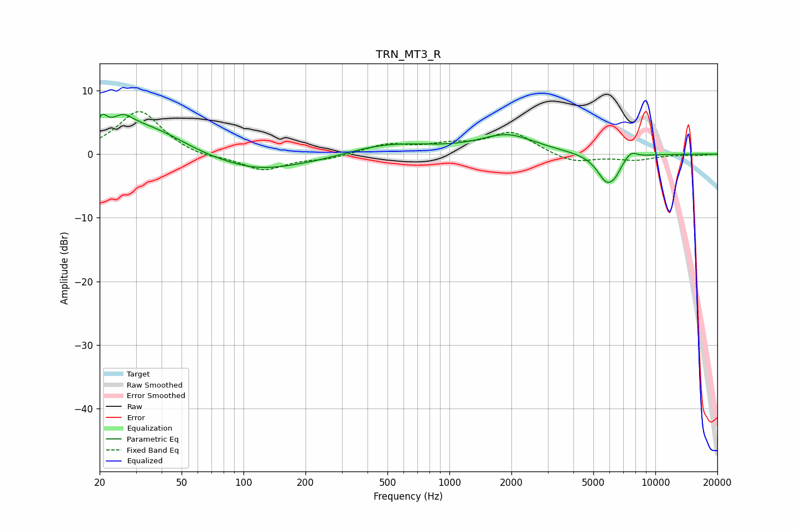

# TRN_MT3_R
See [usage instructions](https://github.com/jaakkopasanen/AutoEq#usage) for more options and info.

### Parametric EQs
Apply preamp of -6.4 dB when using parametric equalizer.

|   # | Type    |   Fc (Hz) |    Q |   Gain (dB) |
|-----|---------|-----------|------|-------------|
|   1 | Peaking |        21 | 5.68 |         2.6 |
|   2 | Peaking |        26 | 2.71 |         2.3 |
|   3 | Peaking |        34 | 0.67 |         5.5 |
|   4 | Peaking |        97 | 0.36 |        -3.1 |
|   5 | Peaking |       118 | 1.35 |        -0.4 |
|   6 | Peaking |       493 | 0.65 |         1.9 |
|   7 | Peaking |      1916 | 1.05 |         2.9 |
|   8 | Peaking |      5822 | 2.83 |        -4.4 |
|   9 | Peaking |      6418 | 5.03 |        -1   |
|  10 | Peaking |      7611 | 4.65 |         1.1 |

### Fixed Band EQs
When using fixed band (also called graphic) equalizer, apply preamp of **-6.8 dB** (if available) and set gains manually with these parameters.

|   # | Type    |   Fc (Hz) |    Q |   Gain (dB) |
|-----|---------|-----------|------|-------------|
|   1 | Peaking |        31 | 1.41 |         6.9 |
|   2 | Peaking |        62 | 1.41 |        -0.7 |
|   3 | Peaking |       125 | 1.41 |        -2.5 |
|   4 | Peaking |       250 | 1.41 |        -0.7 |
|   5 | Peaking |       500 | 1.41 |         1.5 |
|   6 | Peaking |      1000 | 1.41 |         1.2 |
|   7 | Peaking |      2000 | 1.41 |         3.4 |
|   8 | Peaking |      4000 | 1.41 |        -1.5 |
|   9 | Peaking |      8000 | 1.41 |        -0.9 |
|  10 | Peaking |     16000 | 1.41 |        -0.2 |

### Graphs

