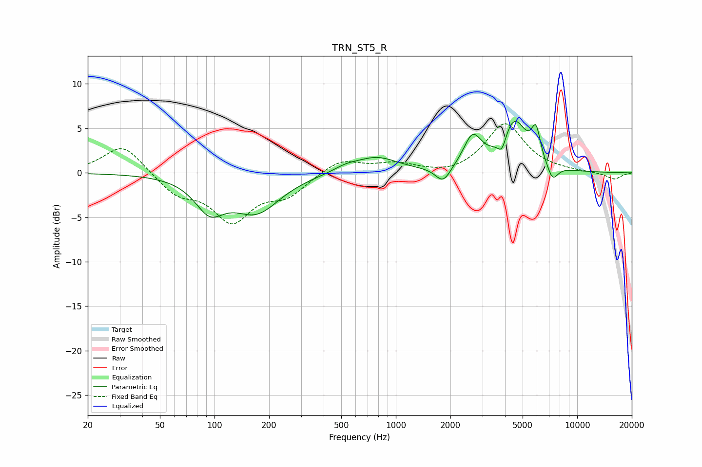

# TRN_ST5_R
See [usage instructions](https://github.com/jaakkopasanen/AutoEq#usage) for more options and info.

### Parametric EQs
Apply preamp of -5.9 dB when using parametric equalizer.

|   # | Type    |   Fc (Hz) |    Q |   Gain (dB) |
|-----|---------|-----------|------|-------------|
|   1 | Peaking |        94 | 1.77 |        -3.5 |
|   2 | Peaking |       170 | 1.08 |        -4.2 |
|   3 | Peaking |       531 | 1.96 |         0.6 |
|   4 | Peaking |       784 | 1.21 |         1.7 |
|   5 | Peaking |      1824 | 3.38 |        -1.8 |
|   6 | Peaking |      2649 | 2.88 |         3.6 |
|   7 | Peaking |      3846 | 5.88 |        -1.8 |
|   8 | Peaking |      4489 | 1.97 |         5.6 |
|   9 | Peaking |      5926 | 5.67 |         3.3 |
|  10 | Peaking |      7312 | 4.51 |        -1.8 |

### Fixed Band EQs
When using fixed band (also called graphic) equalizer, apply preamp of **-5.6 dB** (if available) and set gains manually with these parameters.

|   # | Type    |   Fc (Hz) |    Q |   Gain (dB) |
|-----|---------|-----------|------|-------------|
|   1 | Peaking |        31 | 1.41 |         3.3 |
|   2 | Peaking |        62 | 1.41 |        -2.2 |
|   3 | Peaking |       125 | 1.41 |        -5.1 |
|   4 | Peaking |       250 | 1.41 |        -2.2 |
|   5 | Peaking |       500 | 1.41 |         1.6 |
|   6 | Peaking |      1000 | 1.41 |         1   |
|   7 | Peaking |      2000 | 1.41 |        -0.4 |
|   8 | Peaking |      4000 | 1.41 |         5.5 |
|   9 | Peaking |      8000 | 1.41 |         0.1 |
|  10 | Peaking |     16000 | 1.41 |        -0.7 |

### Graphs

