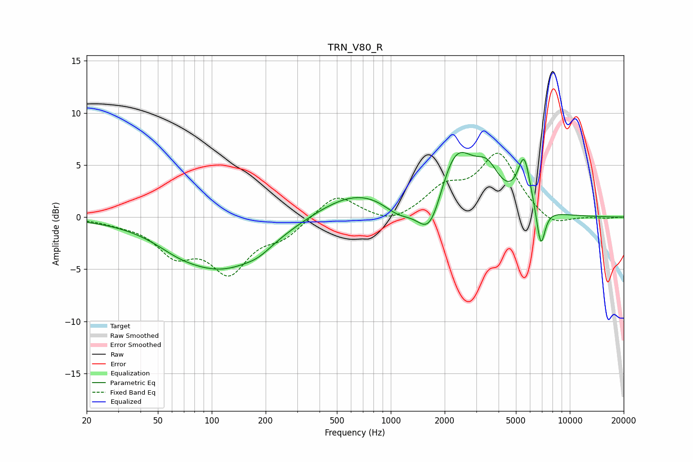

# TRN_V80_R
See [usage instructions](https://github.com/jaakkopasanen/AutoEq#usage) for more options and info.

### Parametric EQs
Apply preamp of -6.3 dB when using parametric equalizer.

|   # | Type    |   Fc (Hz) |    Q |   Gain (dB) |
|-----|---------|-----------|------|-------------|
|   1 | Peaking |        65 | 1.17 |        -0.7 |
|   2 | Peaking |       115 | 0.57 |        -4.8 |
|   3 | Peaking |       182 | 2    |        -0.5 |
|   4 | Peaking |       648 | 0.63 |         2.5 |
|   5 | Peaking |      1096 | 1.72 |        -1.3 |
|   6 | Peaking |      1661 | 1.93 |        -4.7 |
|   7 | Peaking |      2296 | 1.32 |         6.6 |
|   8 | Peaking |      3469 | 2.13 |         2.7 |
|   9 | Peaking |      5558 | 3.85 |         4.8 |
|  10 | Peaking |      6885 | 5.62 |        -4   |

### Fixed Band EQs
When using fixed band (also called graphic) equalizer, apply preamp of **-6.2 dB** (if available) and set gains manually with these parameters.

|   # | Type    |   Fc (Hz) |    Q |   Gain (dB) |
|-----|---------|-----------|------|-------------|
|   1 | Peaking |        31 | 1.41 |        -0.4 |
|   2 | Peaking |        62 | 1.41 |        -3.2 |
|   3 | Peaking |       125 | 1.41 |        -4.8 |
|   4 | Peaking |       250 | 1.41 |        -1.6 |
|   5 | Peaking |       500 | 1.41 |         2.3 |
|   6 | Peaking |      1000 | 1.41 |        -0.8 |
|   7 | Peaking |      2000 | 1.41 |         2.5 |
|   8 | Peaking |      4000 | 1.41 |         5.9 |
|   9 | Peaking |      8000 | 1.41 |        -1.2 |
|  10 | Peaking |     16000 | 1.41 |        -0.1 |

### Graphs

