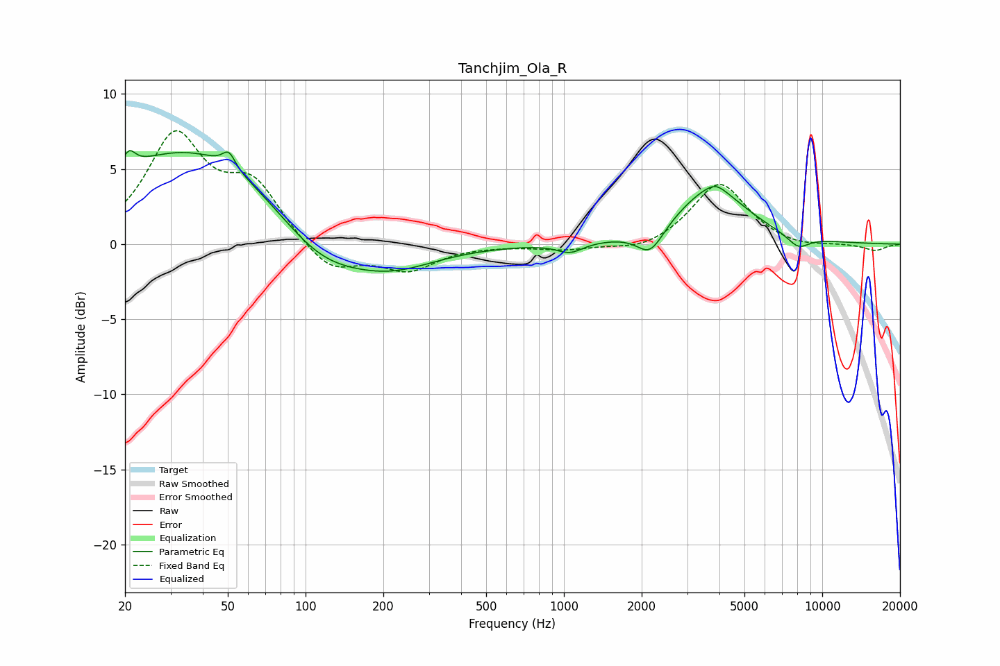

# Tanchjim_Ola_R
See [usage instructions](https://github.com/jaakkopasanen/AutoEq#usage) for more options and info.

### Parametric EQs
Apply preamp of -6.3 dB when using parametric equalizer.

|   # | Type    |   Fc (Hz) |    Q |   Gain (dB) |
|-----|---------|-----------|------|-------------|
|   1 | Peaking |        21 | 6    |         1.1 |
|   2 | Peaking |        37 | 0.38 |         6.6 |
|   3 | Peaking |        50 | 5.84 |         1   |
|   4 | Peaking |       112 | 0.79 |        -3.1 |
|   5 | Peaking |       216 | 0.81 |        -1.6 |
|   6 | Peaking |      1057 | 2.83 |        -0.7 |
|   7 | Peaking |      2159 | 2.74 |        -1.7 |
|   8 | Peaking |      3727 | 1.02 |         3.6 |
|   9 | Peaking |      3869 | 3.95 |         0.4 |
|  10 | Peaking |      8072 | 3.02 |        -0.8 |

### Fixed Band EQs
When using fixed band (also called graphic) equalizer, apply preamp of **-7.7 dB** (if available) and set gains manually with these parameters.

|   # | Type    |   Fc (Hz) |    Q |   Gain (dB) |
|-----|---------|-----------|------|-------------|
|   1 | Peaking |        31 | 1.41 |         7   |
|   2 | Peaking |        62 | 1.41 |         3.6 |
|   3 | Peaking |       125 | 1.41 |        -2   |
|   4 | Peaking |       250 | 1.41 |        -1.7 |
|   5 | Peaking |       500 | 1.41 |        -0   |
|   6 | Peaking |      1000 | 1.41 |        -0.4 |
|   7 | Peaking |      2000 | 1.41 |        -0.5 |
|   8 | Peaking |      4000 | 1.41 |         4.1 |
|   9 | Peaking |      8000 | 1.41 |        -0.3 |
|  10 | Peaking |     16000 | 1.41 |        -0.4 |

### Graphs

