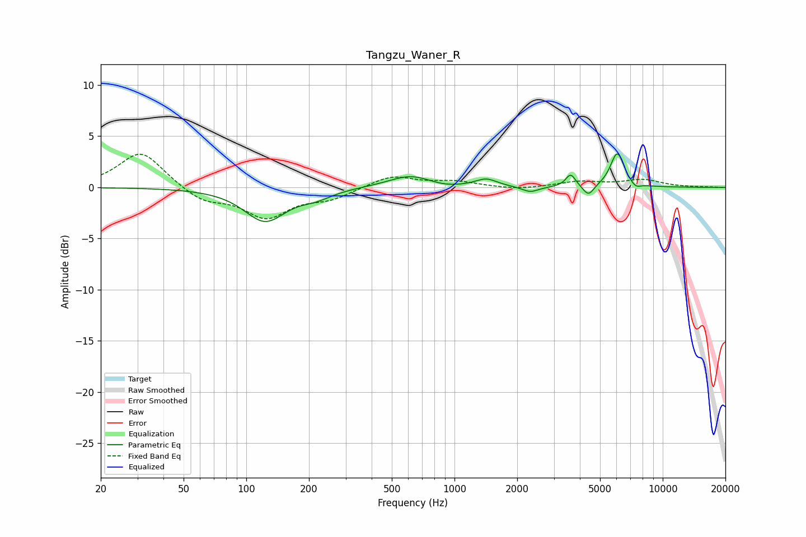

# Tangzu_Waner_R
See [usage instructions](https://github.com/jaakkopasanen/AutoEq#usage) for more options and info.

### Parametric EQs
Apply preamp of -3.4 dB when using parametric equalizer.

|   # | Type    |   Fc (Hz) |    Q |   Gain (dB) |
|-----|---------|-----------|------|-------------|
|   1 | Peaking |       123 | 1.42 |        -3.2 |
|   2 | Peaking |       216 | 1.86 |        -0.7 |
|   3 | Peaking |       619 | 1.31 |         1.2 |
|   4 | Peaking |       874 | 1.74 |        -0.3 |
|   5 | Peaking |      1421 | 2.74 |         0.8 |
|   6 | Peaking |      2310 | 3.53 |        -0.6 |
|   7 | Peaking |      3615 | 6    |         1.2 |
|   8 | Peaking |      4403 | 5.41 |        -1.1 |
|   9 | Peaking |      6052 | 4.17 |         3.4 |
|  10 | Peaking |      7405 | 5.62 |        -0.5 |

### Fixed Band EQs
When using fixed band (also called graphic) equalizer, apply preamp of **-3.3 dB** (if available) and set gains manually with these parameters.

|   # | Type    |   Fc (Hz) |    Q |   Gain (dB) |
|-----|---------|-----------|------|-------------|
|   1 | Peaking |        31 | 1.41 |         3.6 |
|   2 | Peaking |        62 | 1.41 |        -1.4 |
|   3 | Peaking |       125 | 1.41 |        -2.8 |
|   4 | Peaking |       250 | 1.41 |        -1   |
|   5 | Peaking |       500 | 1.41 |         1.2 |
|   6 | Peaking |      1000 | 1.41 |         0.5 |
|   7 | Peaking |      2000 | 1.41 |        -0.2 |
|   8 | Peaking |      4000 | 1.41 |         0.5 |
|   9 | Peaking |      8000 | 1.41 |         0.7 |
|  10 | Peaking |     16000 | 1.41 |         0   |

### Graphs

