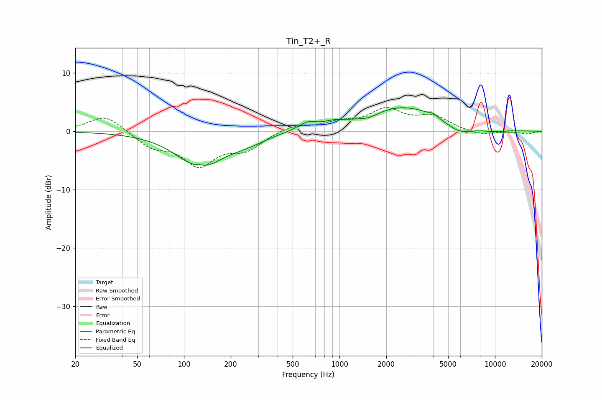

# Tin_T2+_R
See [usage instructions](https://github.com/jaakkopasanen/AutoEq#usage) for more options and info.

### Parametric EQs
Apply preamp of -4.1 dB when using parametric equalizer.

|   # | Type    |   Fc (Hz) |    Q |   Gain (dB) |
|-----|---------|-----------|------|-------------|
|   1 | Peaking |       125 | 4.69 |         0.4 |
|   2 | Peaking |       127 | 0.96 |        -5.9 |
|   3 | Peaking |       255 | 1.19 |        -1.2 |
|   4 | Peaking |       624 | 2.4  |         1.2 |
|   5 | Peaking |       919 | 2.75 |         0.5 |
|   6 | Peaking |      1538 | 1.97 |        -0.9 |
|   7 | Peaking |      2526 | 0.53 |         4.4 |
|   8 | Peaking |      4019 | 5.7  |         0.4 |
|   9 | Peaking |      5848 | 1.5  |        -1.8 |
|  10 | Peaking |      9650 | 1.56 |        -0.4 |

### Fixed Band EQs
When using fixed band (also called graphic) equalizer, apply preamp of **-4.2 dB** (if available) and set gains manually with these parameters.

|   # | Type    |   Fc (Hz) |    Q |   Gain (dB) |
|-----|---------|-----------|------|-------------|
|   1 | Peaking |        31 | 1.41 |         2.9 |
|   2 | Peaking |        62 | 1.41 |        -2.5 |
|   3 | Peaking |       125 | 1.41 |        -5.4 |
|   4 | Peaking |       250 | 1.41 |        -2.8 |
|   5 | Peaking |       500 | 1.41 |         1   |
|   6 | Peaking |      1000 | 1.41 |         1.3 |
|   7 | Peaking |      2000 | 1.41 |         3.5 |
|   8 | Peaking |      4000 | 1.41 |         2.3 |
|   9 | Peaking |      8000 | 1.41 |        -0.7 |
|  10 | Peaking |     16000 | 1.41 |        -0.5 |

### Graphs

