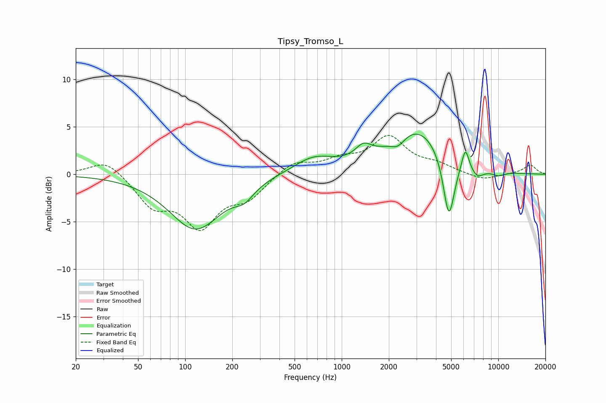

# Tipsy_Tromso_L
See [usage instructions](https://github.com/jaakkopasanen/AutoEq#usage) for more options and info.

### Parametric EQs
Apply preamp of -4.3 dB when using parametric equalizer.

|   # | Type    |   Fc (Hz) |    Q |   Gain (dB) |
|-----|---------|-----------|------|-------------|
|   1 | Peaking |       116 | 0.84 |        -5.7 |
|   2 | Peaking |       239 | 2.32 |        -1.2 |
|   3 | Peaking |       662 | 1.08 |         1.7 |
|   4 | Peaking |      1376 | 2.78 |         1.4 |
|   5 | Peaking |      2290 | 3.01 |        -1.1 |
|   6 | Peaking |      3016 | 0.78 |         4.8 |
|   7 | Peaking |      4835 | 3.81 |        -6.9 |
|   8 | Peaking |      6163 | 5.97 |         2.3 |
|   9 | Peaking |      7327 | 3.13 |        -1.1 |
|  10 | Peaking |     10000 | 2.77 |        -0.5 |

### Fixed Band EQs
When using fixed band (also called graphic) equalizer, apply preamp of **-4.2 dB** (if available) and set gains manually with these parameters.

|   # | Type    |   Fc (Hz) |    Q |   Gain (dB) |
|-----|---------|-----------|------|-------------|
|   1 | Peaking |        31 | 1.41 |         1.7 |
|   2 | Peaking |        62 | 1.41 |        -3.1 |
|   3 | Peaking |       125 | 1.41 |        -5.1 |
|   4 | Peaking |       250 | 1.41 |        -2.2 |
|   5 | Peaking |       500 | 1.41 |         1.4 |
|   6 | Peaking |      1000 | 1.41 |         1.3 |
|   7 | Peaking |      2000 | 1.41 |         3.7 |
|   8 | Peaking |      4000 | 1.41 |         0.8 |
|   9 | Peaking |      8000 | 1.41 |        -0.7 |
|  10 | Peaking |     16000 | 1.41 |         1   |

### Graphs

