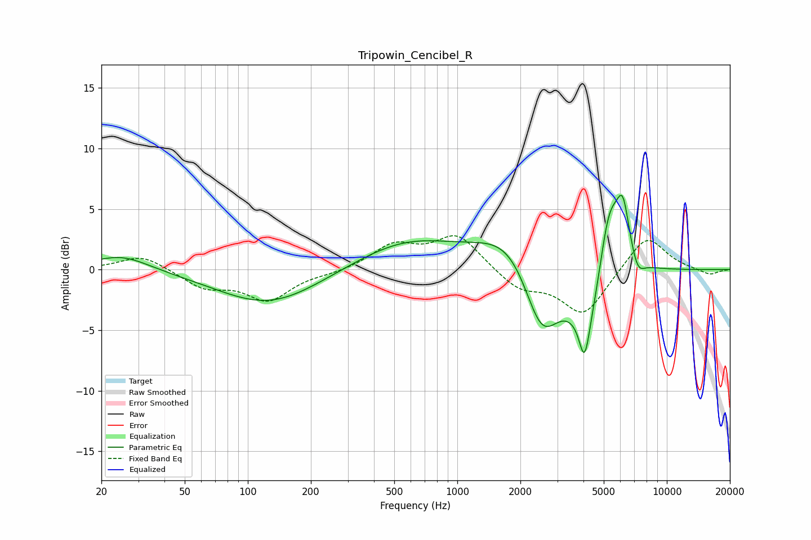

# Tripowin_Cencibel_R
See [usage instructions](https://github.com/jaakkopasanen/AutoEq#usage) for more options and info.

### Parametric EQs
Apply preamp of -6.2 dB when using parametric equalizer.

|   # | Type    |   Fc (Hz) |    Q |   Gain (dB) |
|-----|---------|-----------|------|-------------|
|   1 | Peaking |        25 | 1.06 |         1.3 |
|   2 | Peaking |       126 | 0.58 |        -2.9 |
|   3 | Peaking |       576 | 0.57 |         2.4 |
|   4 | Peaking |      1874 | 0.91 |         3.6 |
|   5 | Peaking |      2517 | 1.54 |        -6.7 |
|   6 | Peaking |      4046 | 5.87 |        -3.4 |
|   7 | Peaking |      4359 | 1.62 |        -6   |
|   8 | Peaking |      5289 | 2.36 |         7.8 |
|   9 | Peaking |      6174 | 4.39 |         4.3 |
|  10 | Peaking |      7264 | 4.31 |        -1.3 |

### Fixed Band EQs
When using fixed band (also called graphic) equalizer, apply preamp of **-2.9 dB** (if available) and set gains manually with these parameters.

|   # | Type    |   Fc (Hz) |    Q |   Gain (dB) |
|-----|---------|-----------|------|-------------|
|   1 | Peaking |        31 | 1.41 |         1.2 |
|   2 | Peaking |        62 | 1.41 |        -1.4 |
|   3 | Peaking |       125 | 1.41 |        -2.4 |
|   4 | Peaking |       250 | 1.41 |        -0.3 |
|   5 | Peaking |       500 | 1.41 |         1.9 |
|   6 | Peaking |      1000 | 1.41 |         2.8 |
|   7 | Peaking |      2000 | 1.41 |        -1.6 |
|   8 | Peaking |      4000 | 1.41 |        -3.7 |
|   9 | Peaking |      8000 | 1.41 |         3   |
|  10 | Peaking |     16000 | 1.41 |        -0.5 |

### Graphs

