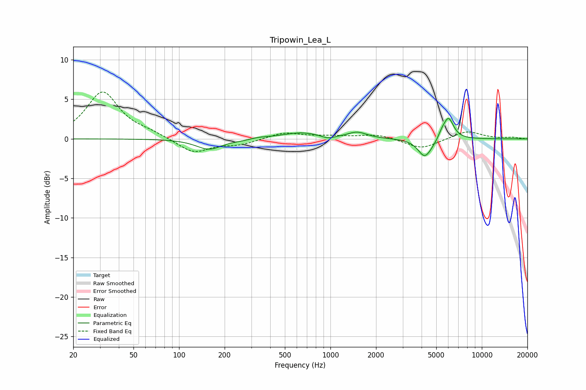

# Tripowin_Lea_L
See [usage instructions](https://github.com/jaakkopasanen/AutoEq#usage) for more options and info.

### Parametric EQs
Apply preamp of -2.7 dB when using parametric equalizer.

|   # | Type    |   Fc (Hz) |    Q |   Gain (dB) |
|-----|---------|-----------|------|-------------|
|   1 | Peaking |       158 | 1.69 |        -1.3 |
|   2 | Peaking |       264 | 2.1  |        -0.2 |
|   3 | Peaking |       330 | 1.86 |         0.2 |
|   4 | Peaking |       643 | 1.15 |         0.8 |
|   5 | Peaking |       963 | 3.29 |        -0.4 |
|   6 | Peaking |      1503 | 2.28 |         0.8 |
|   7 | Peaking |      4176 | 3.23 |        -2.1 |
|   8 | Peaking |      4592 | 2.69 |        -0.5 |
|   9 | Peaking |      5439 | 6    |         0.6 |
|  10 | Peaking |      6016 | 4.01 |         2.8 |

### Fixed Band EQs
When using fixed band (also called graphic) equalizer, apply preamp of **-6.0 dB** (if available) and set gains manually with these parameters.

|   # | Type    |   Fc (Hz) |    Q |   Gain (dB) |
|-----|---------|-----------|------|-------------|
|   1 | Peaking |        31 | 1.41 |         5.9 |
|   2 | Peaking |        62 | 1.41 |         0.6 |
|   3 | Peaking |       125 | 1.41 |        -1.8 |
|   4 | Peaking |       250 | 1.41 |        -0.7 |
|   5 | Peaking |       500 | 1.41 |         0.8 |
|   6 | Peaking |      1000 | 1.41 |         0.3 |
|   7 | Peaking |      2000 | 1.41 |         0.6 |
|   8 | Peaking |      4000 | 1.41 |        -1.3 |
|   9 | Peaking |      8000 | 1.41 |         1   |
|  10 | Peaking |     16000 | 1.41 |         0.2 |

### Graphs

