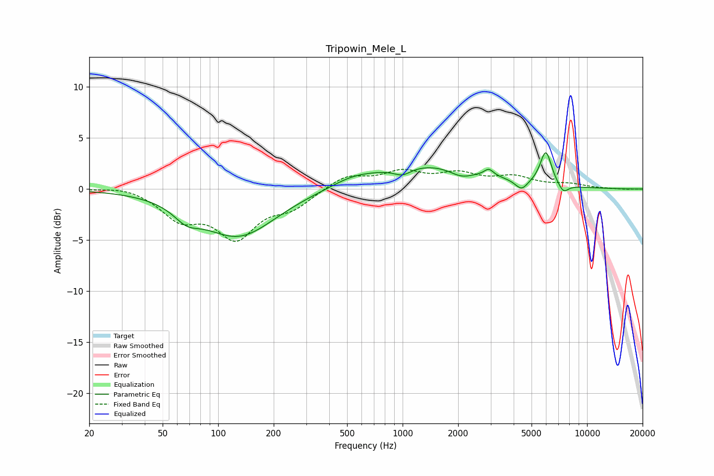

# Tripowin_Mele_L
See [usage instructions](https://github.com/jaakkopasanen/AutoEq#usage) for more options and info.

### Parametric EQs
Apply preamp of -3.7 dB when using parametric equalizer.

|   # | Type    |   Fc (Hz) |    Q |   Gain (dB) |
|-----|---------|-----------|------|-------------|
|   1 | Peaking |        67 | 2.08 |        -1.3 |
|   2 | Peaking |       129 | 0.7  |        -4.6 |
|   3 | Peaking |       534 | 1.27 |         0.6 |
|   4 | Peaking |       998 | 2.95 |        -0.8 |
|   5 | Peaking |      1382 | 0.46 |         2.4 |
|   6 | Peaking |      2082 | 2.16 |        -0.8 |
|   7 | Peaking |      2932 | 5.62 |         0.7 |
|   8 | Peaking |      4411 | 4.13 |        -1   |
|   9 | Peaking |      5976 | 4.47 |         3.3 |
|  10 | Peaking |      7431 | 4.8  |        -0.9 |

### Fixed Band EQs
When using fixed band (also called graphic) equalizer, apply preamp of **-2.0 dB** (if available) and set gains manually with these parameters.

|   # | Type    |   Fc (Hz) |    Q |   Gain (dB) |
|-----|---------|-----------|------|-------------|
|   1 | Peaking |        31 | 1.41 |         0.4 |
|   2 | Peaking |        62 | 1.41 |        -2.6 |
|   3 | Peaking |       125 | 1.41 |        -4.4 |
|   4 | Peaking |       250 | 1.41 |        -1.6 |
|   5 | Peaking |       500 | 1.41 |         1.3 |
|   6 | Peaking |      1000 | 1.41 |         1.5 |
|   7 | Peaking |      2000 | 1.41 |         1.3 |
|   8 | Peaking |      4000 | 1.41 |         1.1 |
|   9 | Peaking |      8000 | 1.41 |         0.4 |
|  10 | Peaking |     16000 | 1.41 |        -0   |

### Graphs

