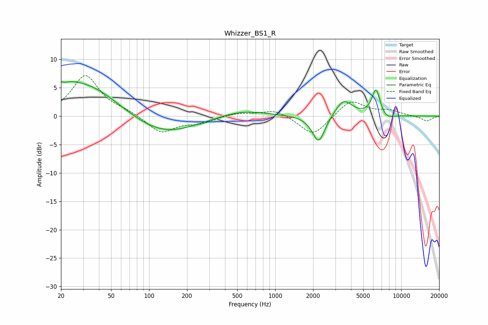

# Whizzer_BS1_R
See [usage instructions](https://github.com/jaakkopasanen/AutoEq#usage) for more options and info.

### Parametric EQs
Apply preamp of -6.2 dB when using parametric equalizer.

|   # | Type    |   Fc (Hz) |    Q |   Gain (dB) |
|-----|---------|-----------|------|-------------|
|   1 | Peaking |        21 | 5.75 |         3.2 |
|   2 | Peaking |        21 | 5.95 |        -2.6 |
|   3 | Peaking |        23 | 1.71 |         1.4 |
|   4 | Peaking |        32 | 0.57 |         5.6 |
|   5 | Peaking |       128 | 0.56 |        -3.4 |
|   6 | Peaking |       547 | 0.75 |         1.2 |
|   7 | Peaking |      2213 | 2.77 |        -4.9 |
|   8 | Peaking |      3490 | 2.1  |         3   |
|   9 | Peaking |      6316 | 4.02 |         4.8 |
|  10 | Peaking |      7558 | 2.55 |        -1   |

### Fixed Band EQs
When using fixed band (also called graphic) equalizer, apply preamp of **-7.2 dB** (if available) and set gains manually with these parameters.

|   # | Type    |   Fc (Hz) |    Q |   Gain (dB) |
|-----|---------|-----------|------|-------------|
|   1 | Peaking |        31 | 1.41 |         7.1 |
|   2 | Peaking |        62 | 1.41 |         0.7 |
|   3 | Peaking |       125 | 1.41 |        -3   |
|   4 | Peaking |       250 | 1.41 |        -1.1 |
|   5 | Peaking |       500 | 1.41 |         0.6 |
|   6 | Peaking |      1000 | 1.41 |         1.2 |
|   7 | Peaking |      2000 | 1.41 |        -3.6 |
|   8 | Peaking |      4000 | 1.41 |         2.9 |
|   9 | Peaking |      8000 | 1.41 |         0.9 |
|  10 | Peaking |     16000 | 1.41 |        -0.9 |

### Graphs

