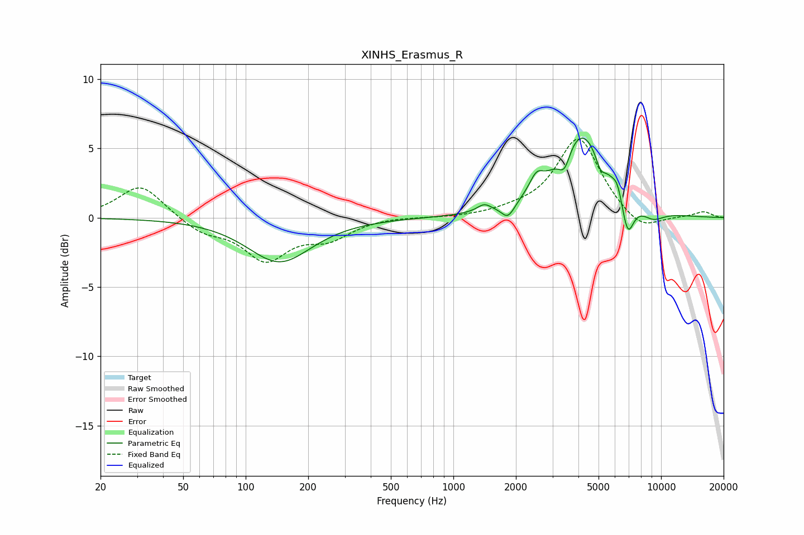

# XINHS_Erasmus_R
See [usage instructions](https://github.com/jaakkopasanen/AutoEq#usage) for more options and info.

### Parametric EQs
Apply preamp of -5.8 dB when using parametric equalizer.

|   # | Type    |   Fc (Hz) |    Q |   Gain (dB) |
|-----|---------|-----------|------|-------------|
|   1 | Peaking |       146 | 0.93 |        -3.2 |
|   2 | Peaking |      1406 | 4.28 |         0.5 |
|   3 | Peaking |      1833 | 4.39 |        -1.1 |
|   4 | Peaking |      2510 | 4.26 |         1.2 |
|   5 | Peaking |      3430 | 5.06 |        -1.5 |
|   6 | Peaking |      4133 | 1.18 |         6.2 |
|   7 | Peaking |      5105 | 6    |        -1   |
|   8 | Peaking |      6165 | 6    |         0.9 |
|   9 | Peaking |      6900 | 4.48 |        -2.8 |
|  10 | Peaking |      9113 | 2.26 |        -0.8 |

### Fixed Band EQs
When using fixed band (also called graphic) equalizer, apply preamp of **-5.8 dB** (if available) and set gains manually with these parameters.

|   # | Type    |   Fc (Hz) |    Q |   Gain (dB) |
|-----|---------|-----------|------|-------------|
|   1 | Peaking |        31 | 1.41 |         2.4 |
|   2 | Peaking |        62 | 1.41 |        -1   |
|   3 | Peaking |       125 | 1.41 |        -2.9 |
|   4 | Peaking |       250 | 1.41 |        -1.3 |
|   5 | Peaking |       500 | 1.41 |         0.1 |
|   6 | Peaking |      1000 | 1.41 |        -0   |
|   7 | Peaking |      2000 | 1.41 |         0.3 |
|   8 | Peaking |      4000 | 1.41 |         5.8 |
|   9 | Peaking |      8000 | 1.41 |        -1.2 |
|  10 | Peaking |     16000 | 1.41 |         0.4 |

### Graphs

