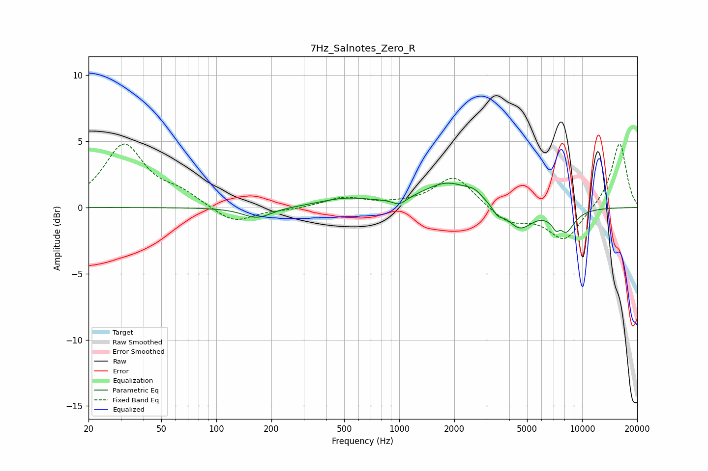

# 7Hz_Salnotes_Zero_R
See [usage instructions](https://github.com/jaakkopasanen/AutoEq#usage) for more options and info.

### Parametric EQs
Apply preamp of -1.9 dB when using parametric equalizer.

|   # | Type    |   Fc (Hz) |    Q |   Gain (dB) |
|-----|---------|-----------|------|-------------|
|   1 | Peaking |       167 | 1.8  |        -0.8 |
|   2 | Peaking |       506 | 0.99 |         0.6 |
|   3 | Peaking |      1001 | 3.83 |        -0.5 |
|   4 | Peaking |      1846 | 1.04 |         1.8 |
|   5 | Peaking |      2574 | 3.34 |         0.5 |
|   6 | Peaking |      3456 | 5.03 |        -0.6 |
|   7 | Peaking |      4550 | 2.03 |        -1.7 |
|   8 | Peaking |      7266 | 5.91 |        -0.8 |
|   9 | Peaking |      7566 | 5.67 |         0.7 |
|  10 | Peaking |      8011 | 2.58 |        -1.9 |

### Fixed Band EQs
When using fixed band (also called graphic) equalizer, apply preamp of **-4.9 dB** (if available) and set gains manually with these parameters.

|   # | Type    |   Fc (Hz) |    Q |   Gain (dB) |
|-----|---------|-----------|------|-------------|
|   1 | Peaking |        31 | 1.41 |         4.7 |
|   2 | Peaking |        62 | 1.41 |         0.9 |
|   3 | Peaking |       125 | 1.41 |        -1.2 |
|   4 | Peaking |       250 | 1.41 |        -0.2 |
|   5 | Peaking |       500 | 1.41 |         0.7 |
|   6 | Peaking |      1000 | 1.41 |         0.1 |
|   7 | Peaking |      2000 | 1.41 |         2.4 |
|   8 | Peaking |      4000 | 1.41 |        -1.2 |
|   9 | Peaking |      8000 | 1.41 |        -2.5 |
|  10 | Peaking |     16000 | 1.41 |         4.9 |

### Graphs

