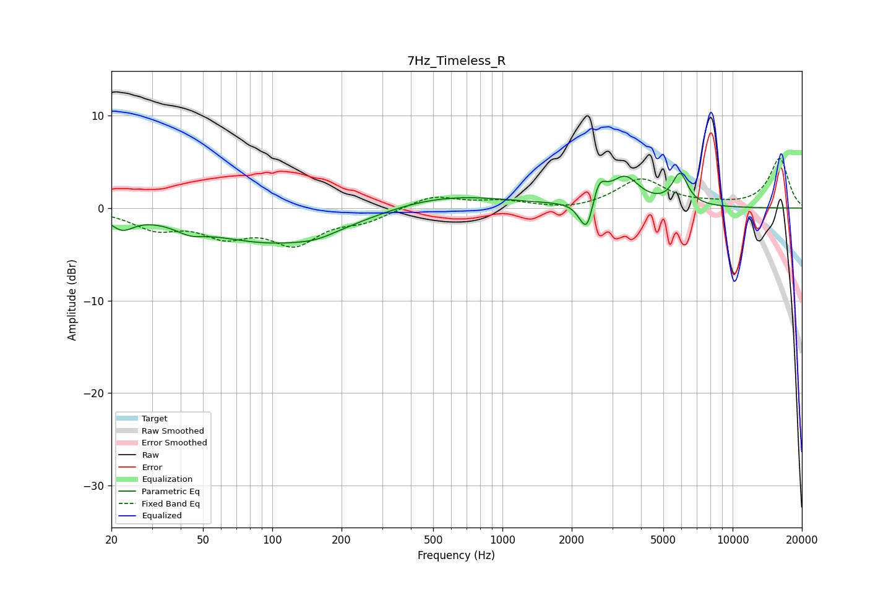

# 7Hz_Timeless_R
See [usage instructions](https://github.com/jaakkopasanen/AutoEq#usage) for more options and info.

### Parametric EQs
Apply preamp of -3.9 dB when using parametric equalizer.

|   # | Type    |   Fc (Hz) |    Q |   Gain (dB) |
|-----|---------|-----------|------|-------------|
|   1 | Peaking |        22 | 2.79 |        -1.6 |
|   2 | Peaking |        44 | 2.28 |        -0.9 |
|   3 | Peaking |       105 | 0.46 |        -3.8 |
|   4 | Peaking |       156 | 1.8  |        -0.4 |
|   5 | Peaking |       552 | 0.52 |         1.6 |
|   6 | Peaking |      2227 | 4.41 |        -1.2 |
|   7 | Peaking |      2344 | 5.73 |        -2.6 |
|   8 | Peaking |      2632 | 4.87 |         2.3 |
|   9 | Peaking |      3405 | 2.26 |         3.1 |
|  10 | Peaking |      5912 | 4.22 |         3.4 |

### Fixed Band EQs
When using fixed band (also called graphic) equalizer, apply preamp of **-5.5 dB** (if available) and set gains manually with these parameters.

|   # | Type    |   Fc (Hz) |    Q |   Gain (dB) |
|-----|---------|-----------|------|-------------|
|   1 | Peaking |        31 | 1.41 |        -2   |
|   2 | Peaking |        62 | 1.41 |        -2.5 |
|   3 | Peaking |       125 | 1.41 |        -3.5 |
|   4 | Peaking |       250 | 1.41 |        -1.2 |
|   5 | Peaking |       500 | 1.41 |         1.4 |
|   6 | Peaking |      1000 | 1.41 |         0.7 |
|   7 | Peaking |      2000 | 1.41 |        -0.3 |
|   8 | Peaking |      4000 | 1.41 |         3.1 |
|   9 | Peaking |      8000 | 1.41 |         0.3 |
|  10 | Peaking |     16000 | 1.41 |         5.3 |

### Graphs

