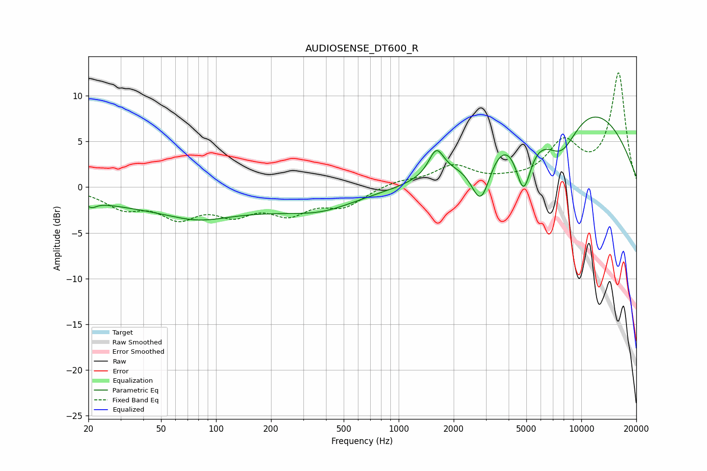

# AUDIOSENSE_DT600_R
See [usage instructions](https://github.com/jaakkopasanen/AutoEq#usage) for more options and info.

### Parametric EQs
Apply preamp of -7.8 dB when using parametric equalizer.

|   # | Type    |   Fc (Hz) |    Q |   Gain (dB) |
|-----|---------|-----------|------|-------------|
|   1 | Peaking |        21 | 5.03 |        -0.7 |
|   2 | Peaking |        80 | 0.88 |        -1.1 |
|   3 | Peaking |        97 | 0.18 |        -2.4 |
|   4 | Peaking |       379 | 0.81 |        -1   |
|   5 | Peaking |      1607 | 3.41 |         2.9 |
|   6 | Peaking |      2828 | 2.4  |        -6.5 |
|   7 | Peaking |      3422 | 0.91 |         3.4 |
|   8 | Peaking |      4824 | 3.23 |        -6.2 |
|   9 | Peaking |      7786 | 1.41 |        -4.6 |
|  10 | Peaking |      9991 | 0.35 |         9.1 |

### Fixed Band EQs
When using fixed band (also called graphic) equalizer, apply preamp of **-12.6 dB** (if available) and set gains manually with these parameters.

|   # | Type    |   Fc (Hz) |    Q |   Gain (dB) |
|-----|---------|-----------|------|-------------|
|   1 | Peaking |        31 | 1.41 |        -2   |
|   2 | Peaking |        62 | 1.41 |        -2.9 |
|   3 | Peaking |       125 | 1.41 |        -2.4 |
|   4 | Peaking |       250 | 1.41 |        -2.5 |
|   5 | Peaking |       500 | 1.41 |        -1.9 |
|   6 | Peaking |      1000 | 1.41 |         0.6 |
|   7 | Peaking |      2000 | 1.41 |         2.2 |
|   8 | Peaking |      4000 | 1.41 |         0.4 |
|   9 | Peaking |      8000 | 1.41 |         4.5 |
|  10 | Peaking |     16000 | 1.41 |        12.4 |

### Graphs

