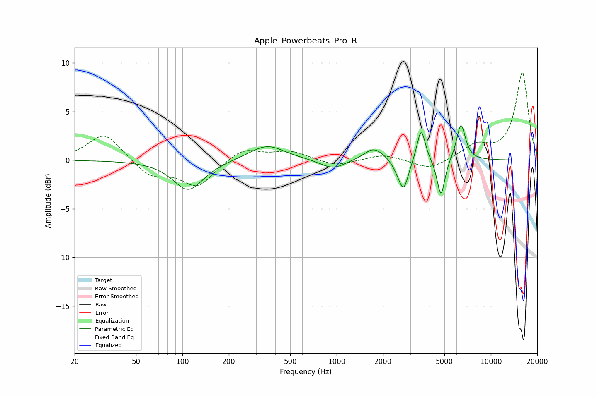

# Apple_Powerbeats_Pro_R
See [usage instructions](https://github.com/jaakkopasanen/AutoEq#usage) for more options and info.

### Parametric EQs
Apply preamp of -3.6 dB when using parametric equalizer.

|   # | Type    |   Fc (Hz) |    Q |   Gain (dB) |
|-----|---------|-----------|------|-------------|
|   1 | Peaking |       109 | 1.46 |        -3.1 |
|   2 | Peaking |       353 | 1.26 |         1.6 |
|   3 | Peaking |       944 | 1.8  |        -1   |
|   4 | Peaking |      1725 | 2.45 |         1   |
|   5 | Peaking |      1984 | 1.62 |         0.4 |
|   6 | Peaking |      2541 | 3.28 |        -0.9 |
|   7 | Peaking |      2728 | 4.64 |        -2.7 |
|   8 | Peaking |      3532 | 5.35 |         3.5 |
|   9 | Peaking |      4748 | 5.64 |        -4   |
|  10 | Peaking |      6402 | 4.77 |         3.8 |

### Fixed Band EQs
When using fixed band (also called graphic) equalizer, apply preamp of **-9.1 dB** (if available) and set gains manually with these parameters.

|   # | Type    |   Fc (Hz) |    Q |   Gain (dB) |
|-----|---------|-----------|------|-------------|
|   1 | Peaking |        31 | 1.41 |         2.8 |
|   2 | Peaking |        62 | 1.41 |        -1.7 |
|   3 | Peaking |       125 | 1.41 |        -2.7 |
|   4 | Peaking |       250 | 1.41 |         1.3 |
|   5 | Peaking |       500 | 1.41 |         0.9 |
|   6 | Peaking |      1000 | 1.41 |        -0.7 |
|   7 | Peaking |      2000 | 1.41 |         0.6 |
|   8 | Peaking |      4000 | 1.41 |        -1   |
|   9 | Peaking |      8000 | 1.41 |         1.4 |
|  10 | Peaking |     16000 | 1.41 |         9   |

### Graphs

