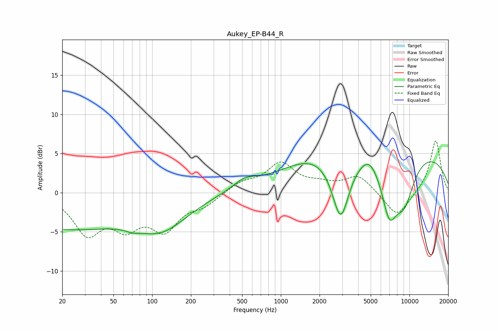

# Aukey_EP-B44_R
See [usage instructions](https://github.com/jaakkopasanen/AutoEq#usage) for more options and info.

### Parametric EQs
Apply preamp of -4.0 dB when using parametric equalizer.

|   # | Type    |   Fc (Hz) |    Q |   Gain (dB) |
|-----|---------|-----------|------|-------------|
|   1 | Peaking |        20 | 0.3  |        -4.4 |
|   2 | Peaking |        70 | 3.14 |        -0.3 |
|   3 | Peaking |       118 | 0.68 |        -4   |
|   4 | Peaking |       524 | 1.52 |         1.2 |
|   5 | Peaking |      1827 | 0.46 |         2.8 |
|   6 | Peaking |      2919 | 2.02 |        -8.7 |
|   7 | Peaking |      4823 | 2.47 |         1.1 |
|   8 | Peaking |      6968 | 2.19 |        -6.5 |
|   9 | Peaking |      8647 | 0.21 |         5.6 |
|  10 | Peaking |      9090 | 1.53 |        -5.8 |

### Fixed Band EQs
When using fixed band (also called graphic) equalizer, apply preamp of **-6.7 dB** (if available) and set gains manually with these parameters.

|   # | Type    |   Fc (Hz) |    Q |   Gain (dB) |
|-----|---------|-----------|------|-------------|
|   1 | Peaking |        31 | 1.41 |        -4.9 |
|   2 | Peaking |        62 | 1.41 |        -3.7 |
|   3 | Peaking |       125 | 1.41 |        -4.3 |
|   4 | Peaking |       250 | 1.41 |        -1.4 |
|   5 | Peaking |       500 | 1.41 |         1.2 |
|   6 | Peaking |      1000 | 1.41 |         3.6 |
|   7 | Peaking |      2000 | 1.41 |         0.8 |
|   8 | Peaking |      4000 | 1.41 |         2.2 |
|   9 | Peaking |      8000 | 1.41 |        -3.2 |
|  10 | Peaking |     16000 | 1.41 |         6.8 |

### Graphs

