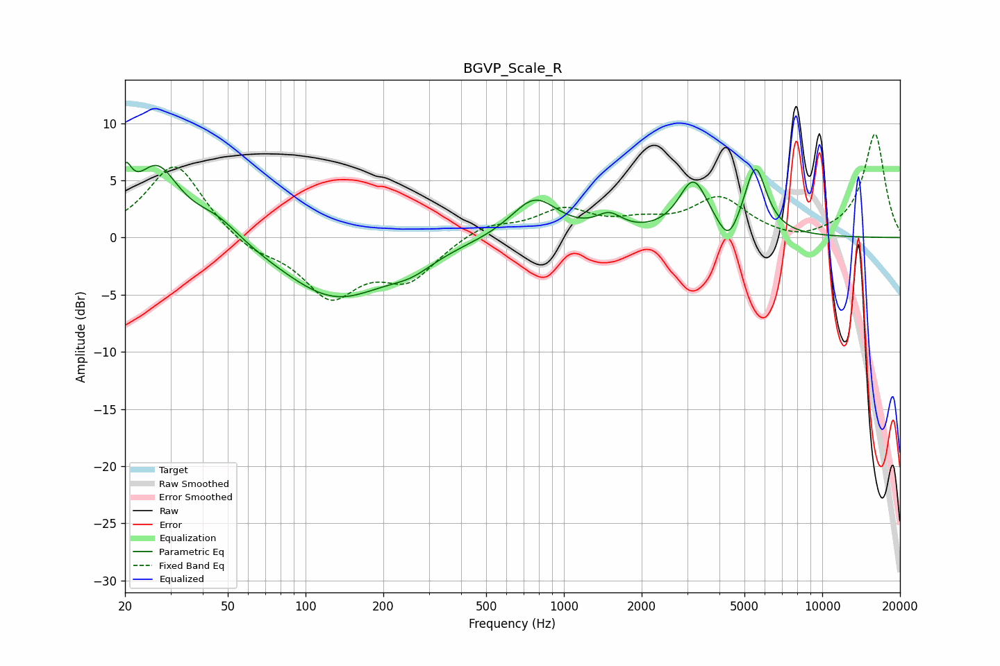

# BGVP_Scale_R
See [usage instructions](https://github.com/jaakkopasanen/AutoEq#usage) for more options and info.

### Parametric EQs
Apply preamp of -6.7 dB when using parametric equalizer.

|   # | Type    |   Fc (Hz) |    Q |   Gain (dB) |
|-----|---------|-----------|------|-------------|
|   1 | Peaking |        20 | 5.7  |         3.4 |
|   2 | Peaking |        27 | 1.63 |         6   |
|   3 | Peaking |        45 | 1.51 |         1.8 |
|   4 | Peaking |       131 | 0.68 |        -5.3 |
|   5 | Peaking |       257 | 1.62 |        -1.1 |
|   6 | Peaking |       770 | 1.56 |         3.5 |
|   7 | Peaking |      1498 | 2.78 |         1.4 |
|   8 | Peaking |      3171 | 2.49 |         4.7 |
|   9 | Peaking |      4335 | 3.48 |        -2.3 |
|  10 | Peaking |      5510 | 3.24 |         6   |

### Fixed Band EQs
When using fixed band (also called graphic) equalizer, apply preamp of **-9.1 dB** (if available) and set gains manually with these parameters.

|   # | Type    |   Fc (Hz) |    Q |   Gain (dB) |
|-----|---------|-----------|------|-------------|
|   1 | Peaking |        31 | 1.41 |         6.6 |
|   2 | Peaking |        62 | 1.41 |        -1.2 |
|   3 | Peaking |       125 | 1.41 |        -4.9 |
|   4 | Peaking |       250 | 1.41 |        -3.4 |
|   5 | Peaking |       500 | 1.41 |         1.2 |
|   6 | Peaking |      1000 | 1.41 |         2.3 |
|   7 | Peaking |      2000 | 1.41 |         1   |
|   8 | Peaking |      4000 | 1.41 |         3.3 |
|   9 | Peaking |      8000 | 1.41 |        -0.5 |
|  10 | Peaking |     16000 | 1.41 |         9.1 |

### Graphs

