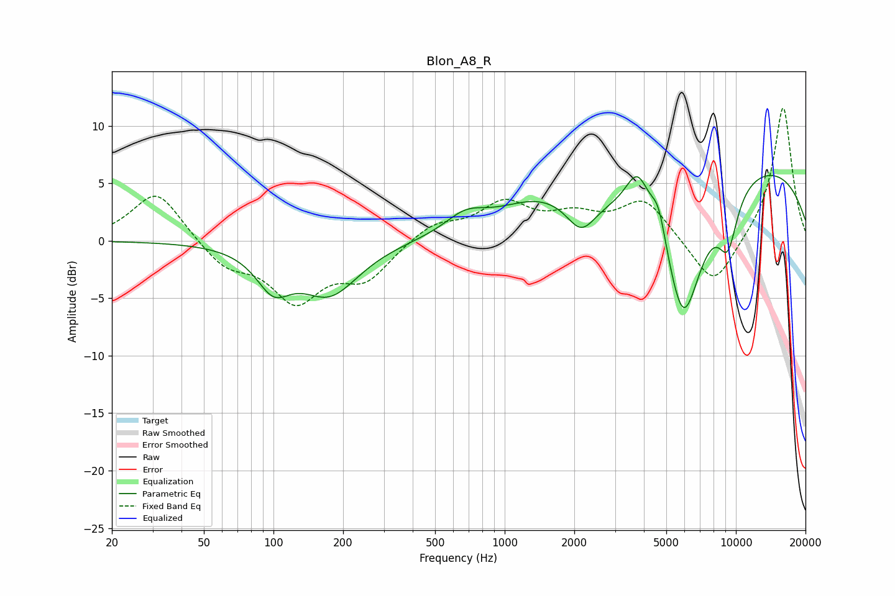

# Blon_A8_R
See [usage instructions](https://github.com/jaakkopasanen/AutoEq#usage) for more options and info.

### Parametric EQs
Apply preamp of -5.8 dB when using parametric equalizer.

|   # | Type    |   Fc (Hz) |    Q |   Gain (dB) |
|-----|---------|-----------|------|-------------|
|   1 | Peaking |       100 | 1.92 |        -3.2 |
|   2 | Peaking |       175 | 1.1  |        -4.5 |
|   3 | Peaking |       677 | 1.6  |         1.6 |
|   4 | Peaking |      1395 | 0.74 |         2.6 |
|   5 | Peaking |      2143 | 2.2  |        -2.8 |
|   6 | Peaking |      3761 | 2.69 |         3.9 |
|   7 | Peaking |      4631 | 4.21 |         2.8 |
|   8 | Peaking |      5925 | 1.51 |       -12.9 |
|   9 | Peaking |      9231 | 2.98 |        -4.6 |
|  10 | Peaking |     10000 | 0.23 |         7.2 |

### Fixed Band EQs
When using fixed band (also called graphic) equalizer, apply preamp of **-11.7 dB** (if available) and set gains manually with these parameters.

|   # | Type    |   Fc (Hz) |    Q |   Gain (dB) |
|-----|---------|-----------|------|-------------|
|   1 | Peaking |        31 | 1.41 |         4.4 |
|   2 | Peaking |        62 | 1.41 |        -2.2 |
|   3 | Peaking |       125 | 1.41 |        -4.9 |
|   4 | Peaking |       250 | 1.41 |        -3.1 |
|   5 | Peaking |       500 | 1.41 |         1.5 |
|   6 | Peaking |      1000 | 1.41 |         3.1 |
|   7 | Peaking |      2000 | 1.41 |         1.8 |
|   8 | Peaking |      4000 | 1.41 |         3.5 |
|   9 | Peaking |      8000 | 1.41 |        -4.4 |
|  10 | Peaking |     16000 | 1.41 |        11.8 |

### Graphs

