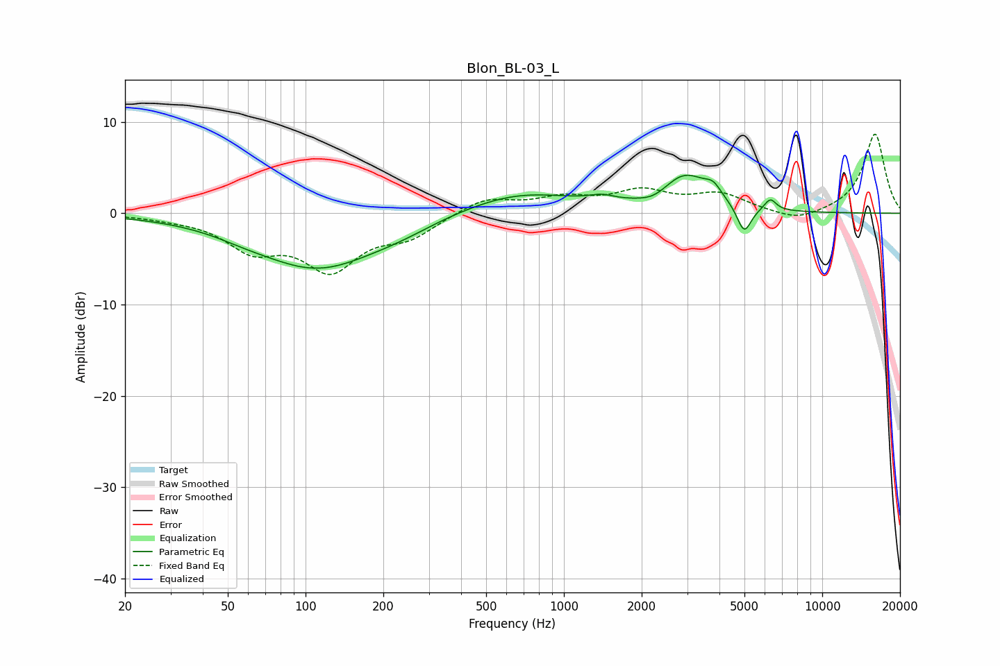

# Blon_BL-03_L
See [usage instructions](https://github.com/jaakkopasanen/AutoEq#usage) for more options and info.

### Parametric EQs
Apply preamp of -4.3 dB when using parametric equalizer.

|   # | Type    |   Fc (Hz) |    Q |   Gain (dB) |
|-----|---------|-----------|------|-------------|
|   1 | Peaking |        58 | 1.37 |        -0.4 |
|   2 | Peaking |       111 | 0.59 |        -5.9 |
|   3 | Peaking |       233 | 1.11 |        -0.6 |
|   4 | Peaking |       671 | 0.63 |         2.3 |
|   5 | Peaking |      1402 | 2.85 |         0.6 |
|   6 | Peaking |      2239 | 2.47 |        -0.8 |
|   7 | Peaking |      2945 | 1.51 |         4   |
|   8 | Peaking |      3785 | 4.4  |         1.2 |
|   9 | Peaking |      4985 | 5.05 |        -3.1 |
|  10 | Peaking |      6292 | 6    |         1.3 |

### Fixed Band EQs
When using fixed band (also called graphic) equalizer, apply preamp of **-8.8 dB** (if available) and set gains manually with these parameters.

|   # | Type    |   Fc (Hz) |    Q |   Gain (dB) |
|-----|---------|-----------|------|-------------|
|   1 | Peaking |        31 | 1.41 |        -0.3 |
|   2 | Peaking |        62 | 1.41 |        -3.5 |
|   3 | Peaking |       125 | 1.41 |        -5.7 |
|   4 | Peaking |       250 | 1.41 |        -2.2 |
|   5 | Peaking |       500 | 1.41 |         1.7 |
|   6 | Peaking |      1000 | 1.41 |         1.5 |
|   7 | Peaking |      2000 | 1.41 |         2.2 |
|   8 | Peaking |      4000 | 1.41 |         1.9 |
|   9 | Peaking |      8000 | 1.41 |        -1.1 |
|  10 | Peaking |     16000 | 1.41 |         8.7 |

### Graphs

