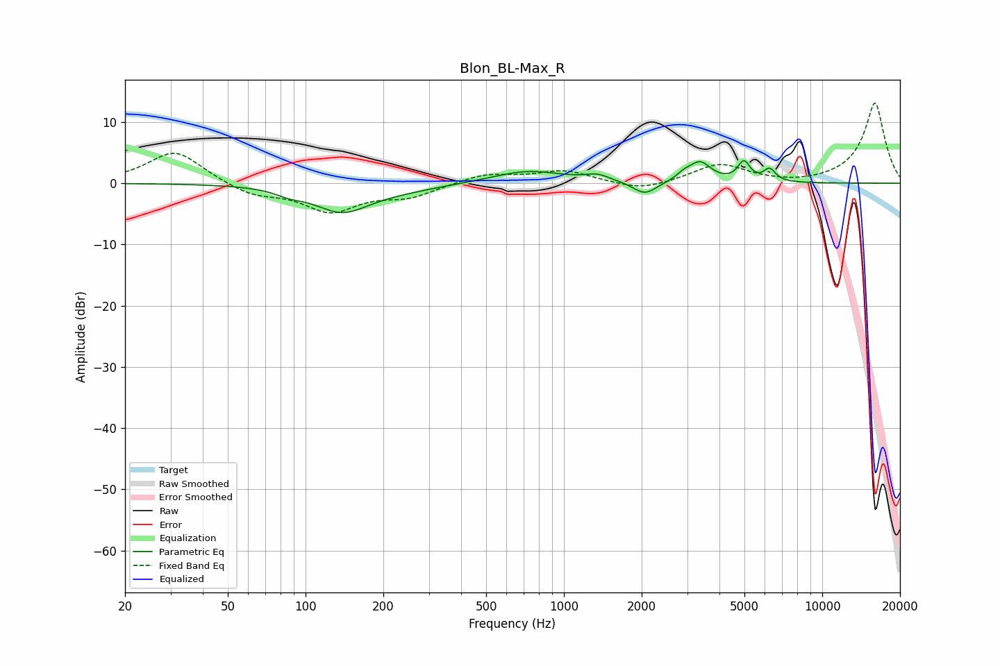

# Blon_BL-Max_R
See [usage instructions](https://github.com/jaakkopasanen/AutoEq#usage) for more options and info.

### Parametric EQs
Apply preamp of -3.8 dB when using parametric equalizer.

|   # | Type    |   Fc (Hz) |    Q |   Gain (dB) |
|-----|---------|-----------|------|-------------|
|   1 | Peaking |        87 | 2.77 |        -0.8 |
|   2 | Peaking |       138 | 1.31 |        -4.3 |
|   3 | Peaking |       233 | 0.86 |        -0.8 |
|   4 | Peaking |       725 | 1.03 |         2.1 |
|   5 | Peaking |      1347 | 3    |         1   |
|   6 | Peaking |      2058 | 3.09 |        -2.2 |
|   7 | Peaking |      2917 | 4.99 |         0.9 |
|   8 | Peaking |      3365 | 3.34 |         3.2 |
|   9 | Peaking |      4975 | 5.98 |         3.1 |
|  10 | Peaking |      6257 | 5.97 |         2   |

### Fixed Band EQs
When using fixed band (also called graphic) equalizer, apply preamp of **-13.2 dB** (if available) and set gains manually with these parameters.

|   # | Type    |   Fc (Hz) |    Q |   Gain (dB) |
|-----|---------|-----------|------|-------------|
|   1 | Peaking |        31 | 1.41 |         5.4 |
|   2 | Peaking |        62 | 1.41 |        -1.9 |
|   3 | Peaking |       125 | 1.41 |        -4.4 |
|   4 | Peaking |       250 | 1.41 |        -2   |
|   5 | Peaking |       500 | 1.41 |         1.5 |
|   6 | Peaking |      1000 | 1.41 |         2   |
|   7 | Peaking |      2000 | 1.41 |        -1.4 |
|   8 | Peaking |      4000 | 1.41 |         3.1 |
|   9 | Peaking |      8000 | 1.41 |        -0.3 |
|  10 | Peaking |     16000 | 1.41 |        13.2 |

### Graphs

