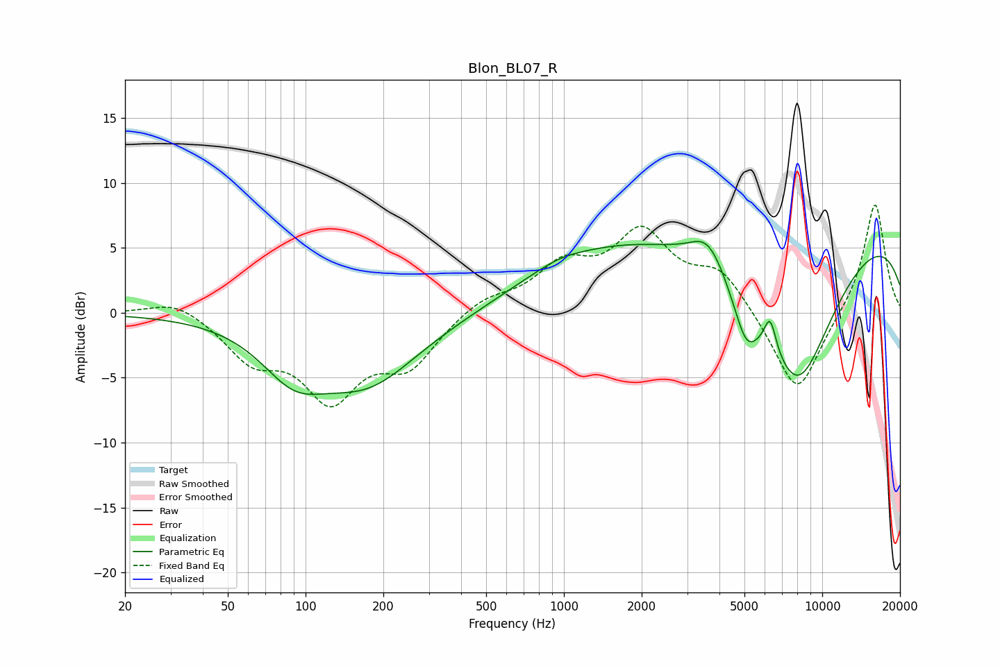

# Blon_BL07_R
See [usage instructions](https://github.com/jaakkopasanen/AutoEq#usage) for more options and info.

### Parametric EQs
Apply preamp of -5.6 dB when using parametric equalizer.

|   # | Type    |   Fc (Hz) |    Q |   Gain (dB) |
|-----|---------|-----------|------|-------------|
|   1 | Peaking |        90 | 1.13 |        -3.5 |
|   2 | Peaking |       173 | 0.7  |        -5.1 |
|   3 | Peaking |       779 | 0.77 |         0.7 |
|   4 | Peaking |       966 | 1.61 |         0.4 |
|   5 | Peaking |      1363 | 0.54 |         2.5 |
|   6 | Peaking |      3613 | 2.09 |         2.4 |
|   7 | Peaking |      5072 | 2.74 |        -3.6 |
|   8 | Peaking |      6286 | 6    |         2.5 |
|   9 | Peaking |      7998 | 0.8  |       -12.7 |
|  10 | Peaking |      9228 | 0.18 |         7.8 |

### Fixed Band EQs
When using fixed band (also called graphic) equalizer, apply preamp of **-8.4 dB** (if available) and set gains manually with these parameters.

|   # | Type    |   Fc (Hz) |    Q |   Gain (dB) |
|-----|---------|-----------|------|-------------|
|   1 | Peaking |        31 | 1.41 |         1.2 |
|   2 | Peaking |        62 | 1.41 |        -3.2 |
|   3 | Peaking |       125 | 1.41 |        -6.1 |
|   4 | Peaking |       250 | 1.41 |        -3.7 |
|   5 | Peaking |       500 | 1.41 |         1.2 |
|   6 | Peaking |      1000 | 1.41 |         3.2 |
|   7 | Peaking |      2000 | 1.41 |         5.7 |
|   8 | Peaking |      4000 | 1.41 |         3   |
|   9 | Peaking |      8000 | 1.41 |        -6.6 |
|  10 | Peaking |     16000 | 1.41 |         8.6 |

### Graphs

