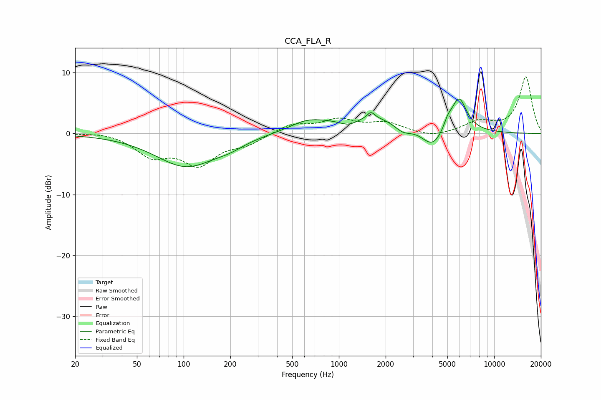

# CCA_FLA_R
See [usage instructions](https://github.com/jaakkopasanen/AutoEq#usage) for more options and info.

### Parametric EQs
Apply preamp of -5.8 dB when using parametric equalizer.

|   # | Type    |   Fc (Hz) |    Q |   Gain (dB) |
|-----|---------|-----------|------|-------------|
|   1 | Peaking |       104 | 0.72 |        -5.4 |
|   2 | Peaking |       199 | 1.58 |        -0.8 |
|   3 | Peaking |       617 | 1.35 |         1.2 |
|   4 | Peaking |      1158 | 2.12 |        -1.4 |
|   5 | Peaking |      1591 | 0.49 |         3.1 |
|   6 | Peaking |      1610 | 6    |         1.1 |
|   7 | Peaking |      2584 | 2.35 |        -1.6 |
|   8 | Peaking |      4010 | 1.93 |        -3.6 |
|   9 | Peaking |      5020 | 5.54 |         1.3 |
|  10 | Peaking |      5924 | 2.74 |         5.7 |

### Fixed Band EQs
When using fixed band (also called graphic) equalizer, apply preamp of **-9.4 dB** (if available) and set gains manually with these parameters.

|   # | Type    |   Fc (Hz) |    Q |   Gain (dB) |
|-----|---------|-----------|------|-------------|
|   1 | Peaking |        31 | 1.41 |         0.4 |
|   2 | Peaking |        62 | 1.41 |        -3.4 |
|   3 | Peaking |       125 | 1.41 |        -4.7 |
|   4 | Peaking |       250 | 1.41 |        -1.5 |
|   5 | Peaking |       500 | 1.41 |         1.5 |
|   6 | Peaking |      1000 | 1.41 |         2.1 |
|   7 | Peaking |      2000 | 1.41 |         1.6 |
|   8 | Peaking |      4000 | 1.41 |        -0.7 |
|   9 | Peaking |      8000 | 1.41 |         1.8 |
|  10 | Peaking |     16000 | 1.41 |         9.3 |

### Graphs

