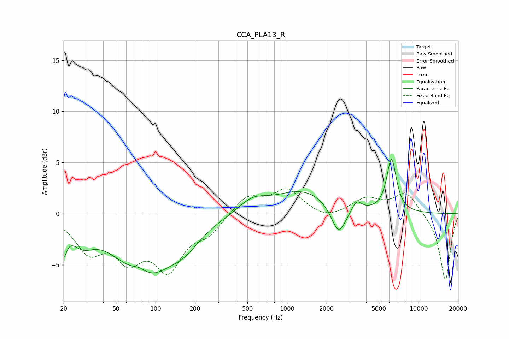

# CCA_PLA13_R
See [usage instructions](https://github.com/jaakkopasanen/AutoEq#usage) for more options and info.

### Parametric EQs
Apply preamp of -5.4 dB when using parametric equalizer.

|   # | Type    |   Fc (Hz) |    Q |   Gain (dB) |
|-----|---------|-----------|------|-------------|
|   1 | Peaking |        20 | 5.98 |        -2.5 |
|   2 | Peaking |        27 | 1.65 |        -1.8 |
|   3 | Peaking |        75 | 2.38 |         0.8 |
|   4 | Peaking |        84 | 0.63 |        -5.9 |
|   5 | Peaking |       169 | 1.31 |        -1.3 |
|   6 | Peaking |       546 | 1.33 |         1.2 |
|   7 | Peaking |      1323 | 0.66 |         2.2 |
|   8 | Peaking |      2471 | 2.51 |        -3   |
|   9 | Peaking |      3383 | 3.92 |         1   |
|  10 | Peaking |      6234 | 3.75 |         5.2 |

### Fixed Band EQs
When using fixed band (also called graphic) equalizer, apply preamp of **-2.5 dB** (if available) and set gains manually with these parameters.

|   # | Type    |   Fc (Hz) |    Q |   Gain (dB) |
|-----|---------|-----------|------|-------------|
|   1 | Peaking |        31 | 1.41 |        -3.3 |
|   2 | Peaking |        62 | 1.41 |        -3.7 |
|   3 | Peaking |       125 | 1.41 |        -4.9 |
|   4 | Peaking |       250 | 1.41 |        -1.6 |
|   5 | Peaking |       500 | 1.41 |         1.8 |
|   6 | Peaking |      1000 | 1.41 |         2.3 |
|   7 | Peaking |      2000 | 1.41 |        -0.6 |
|   8 | Peaking |      4000 | 1.41 |         1.4 |
|   9 | Peaking |      8000 | 1.41 |         2.1 |
|  10 | Peaking |     16000 | 1.41 |        -6.6 |

### Graphs

