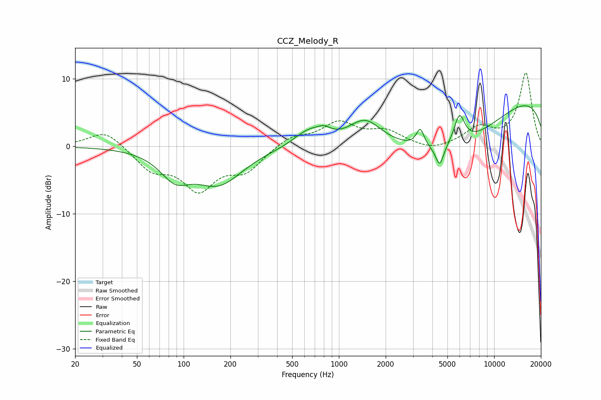

# CCZ_Melody_R
See [usage instructions](https://github.com/jaakkopasanen/AutoEq#usage) for more options and info.

### Parametric EQs
Apply preamp of -6.1 dB when using parametric equalizer.

|   # | Type    |   Fc (Hz) |    Q |   Gain (dB) |
|-----|---------|-----------|------|-------------|
|   1 | Peaking |        88 | 1.47 |        -3.6 |
|   2 | Peaking |       168 | 0.9  |        -5.3 |
|   3 | Peaking |       642 | 1.48 |         2.3 |
|   4 | Peaking |       804 | 3.39 |         0.9 |
|   5 | Peaking |      1473 | 1.4  |         3.5 |
|   6 | Peaking |      3341 | 5.62 |         2.6 |
|   7 | Peaking |      4456 | 5.48 |        -3   |
|   8 | Peaking |      5287 | 0.4  |        -8.2 |
|   9 | Peaking |      5973 | 3.88 |         4.5 |
|  10 | Peaking |     10000 | 0.18 |         8.8 |

### Fixed Band EQs
When using fixed band (also called graphic) equalizer, apply preamp of **-10.9 dB** (if available) and set gains manually with these parameters.

|   # | Type    |   Fc (Hz) |    Q |   Gain (dB) |
|-----|---------|-----------|------|-------------|
|   1 | Peaking |        31 | 1.41 |         2.5 |
|   2 | Peaking |        62 | 1.41 |        -3.2 |
|   3 | Peaking |       125 | 1.41 |        -5.9 |
|   4 | Peaking |       250 | 1.41 |        -3.3 |
|   5 | Peaking |       500 | 1.41 |         1.5 |
|   6 | Peaking |      1000 | 1.41 |         3.3 |
|   7 | Peaking |      2000 | 1.41 |         2   |
|   8 | Peaking |      4000 | 1.41 |        -0.9 |
|   9 | Peaking |      8000 | 1.41 |         2.5 |
|  10 | Peaking |     16000 | 1.41 |        10.8 |

### Graphs

