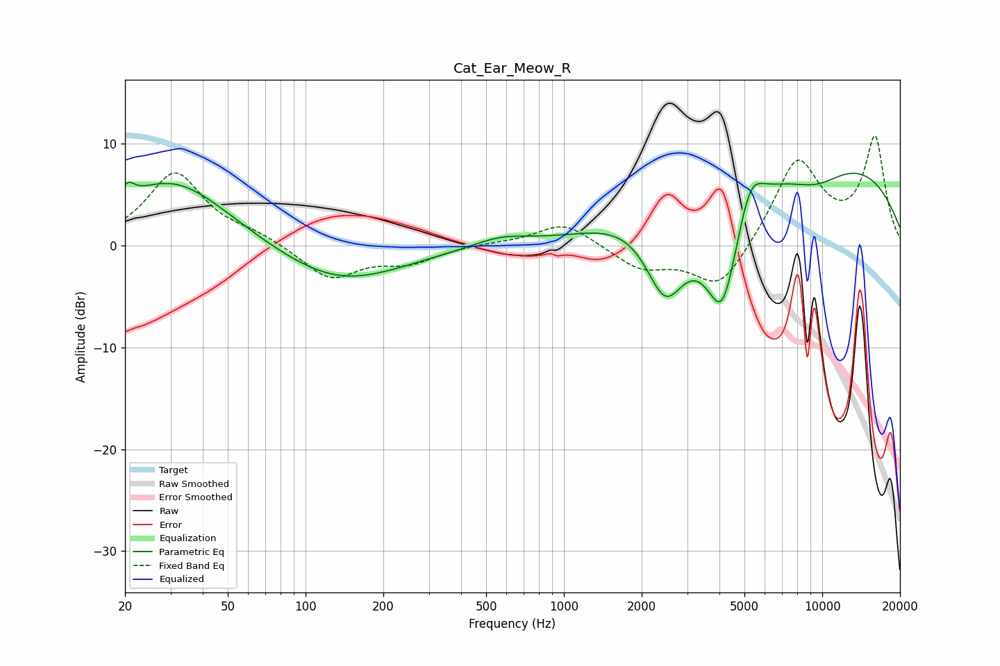

# Cat_Ear_Meow_R
See [usage instructions](https://github.com/jaakkopasanen/AutoEq#usage) for more options and info.

### Parametric EQs
Apply preamp of -7.2 dB when using parametric equalizer.

|   # | Type    |   Fc (Hz) |    Q |   Gain (dB) |
|-----|---------|-----------|------|-------------|
|   1 | Peaking |        21 | 5.92 |         1.4 |
|   2 | Peaking |        31 | 0.64 |         6.6 |
|   3 | Peaking |       134 | 0.58 |        -3.8 |
|   4 | Peaking |       571 | 1.3  |         1   |
|   5 | Peaking |      1916 | 0.88 |         1.6 |
|   6 | Peaking |      2469 | 1.7  |        -8.5 |
|   7 | Peaking |      4105 | 1.94 |       -11.7 |
|   8 | Peaking |      5258 | 2.75 |         4.1 |
|   9 | Peaking |      9211 | 0.25 |         9.3 |
|  10 | Peaking |      9419 | 1.02 |        -2.7 |

### Fixed Band EQs
When using fixed band (also called graphic) equalizer, apply preamp of **-10.8 dB** (if available) and set gains manually with these parameters.

|   # | Type    |   Fc (Hz) |    Q |   Gain (dB) |
|-----|---------|-----------|------|-------------|
|   1 | Peaking |        31 | 1.41 |         7.1 |
|   2 | Peaking |        62 | 1.41 |         0.9 |
|   3 | Peaking |       125 | 1.41 |        -3.3 |
|   4 | Peaking |       250 | 1.41 |        -1.5 |
|   5 | Peaking |       500 | 1.41 |         0.2 |
|   6 | Peaking |      1000 | 1.41 |         2.3 |
|   7 | Peaking |      2000 | 1.41 |        -2.2 |
|   8 | Peaking |      4000 | 1.41 |        -4.5 |
|   9 | Peaking |      8000 | 1.41 |         8.4 |
|  10 | Peaking |     16000 | 1.41 |        10.4 |

### Graphs

