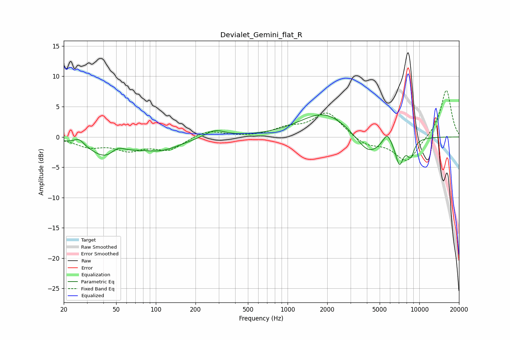

# Devialet_Gemini_flat_R
See [usage instructions](https://github.com/jaakkopasanen/AutoEq#usage) for more options and info.

### Parametric EQs
Apply preamp of -3.7 dB when using parametric equalizer.

|   # | Type    |   Fc (Hz) |    Q |   Gain (dB) |
|-----|---------|-----------|------|-------------|
|   1 | Peaking |        26 | 4    |         1   |
|   2 | Peaking |        44 | 1.1  |        -3.6 |
|   3 | Peaking |        51 | 2.51 |         1.7 |
|   4 | Peaking |       110 | 0.94 |        -1.9 |
|   5 | Peaking |       280 | 1.81 |         1.3 |
|   6 | Peaking |      1902 | 0.76 |         4.1 |
|   7 | Peaking |      4122 | 1.47 |        -3.5 |
|   8 | Peaking |      5704 | 4.35 |         1.9 |
|   9 | Peaking |      7062 | 4.31 |        -4.1 |
|  10 | Peaking |      8592 | 4.72 |        -2.7 |

### Fixed Band EQs
When using fixed band (also called graphic) equalizer, apply preamp of **-7.8 dB** (if available) and set gains manually with these parameters.

|   # | Type    |   Fc (Hz) |    Q |   Gain (dB) |
|-----|---------|-----------|------|-------------|
|   1 | Peaking |        31 | 1.41 |        -1.5 |
|   2 | Peaking |        62 | 1.41 |        -1.9 |
|   3 | Peaking |       125 | 1.41 |        -2   |
|   4 | Peaking |       250 | 1.41 |         1.2 |
|   5 | Peaking |       500 | 1.41 |        -0   |
|   6 | Peaking |      1000 | 1.41 |         1.3 |
|   7 | Peaking |      2000 | 1.41 |         4   |
|   8 | Peaking |      4000 | 1.41 |        -1.4 |
|   9 | Peaking |      8000 | 1.41 |        -4.2 |
|  10 | Peaking |     16000 | 1.41 |         7.9 |

### Graphs

