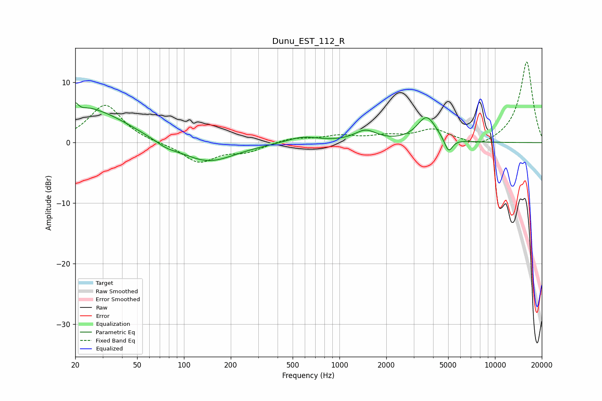

# Dunu_EST_112_R
See [usage instructions](https://github.com/jaakkopasanen/AutoEq#usage) for more options and info.

### Parametric EQs
Apply preamp of -6.7 dB when using parametric equalizer.

|   # | Type    |   Fc (Hz) |    Q |   Gain (dB) |
|-----|---------|-----------|------|-------------|
|   1 | Peaking |        20 | 5.99 |         5.2 |
|   2 | Peaking |        20 | 5.99 |        -2.9 |
|   3 | Peaking |        24 | 2.24 |         1   |
|   4 | Peaking |        28 | 0.67 |         4.8 |
|   5 | Peaking |        77 | 2.06 |        -0.7 |
|   6 | Peaking |       142 | 0.82 |        -3.3 |
|   7 | Peaking |       579 | 1.36 |         1.1 |
|   8 | Peaking |      1472 | 2.04 |         1.8 |
|   9 | Peaking |      3635 | 2.32 |         4.2 |
|  10 | Peaking |      5026 | 5.33 |        -2.4 |

### Fixed Band EQs
When using fixed band (also called graphic) equalizer, apply preamp of **-13.4 dB** (if available) and set gains manually with these parameters.

|   # | Type    |   Fc (Hz) |    Q |   Gain (dB) |
|-----|---------|-----------|------|-------------|
|   1 | Peaking |        31 | 1.41 |         6.3 |
|   2 | Peaking |        62 | 1.41 |        -0.1 |
|   3 | Peaking |       125 | 1.41 |        -3.2 |
|   4 | Peaking |       250 | 1.41 |        -1.4 |
|   5 | Peaking |       500 | 1.41 |         0.8 |
|   6 | Peaking |      1000 | 1.41 |         1   |
|   7 | Peaking |      2000 | 1.41 |         0.9 |
|   8 | Peaking |      4000 | 1.41 |         2.1 |
|   9 | Peaking |      8000 | 1.41 |        -1.1 |
|  10 | Peaking |     16000 | 1.41 |        13.5 |

### Graphs

