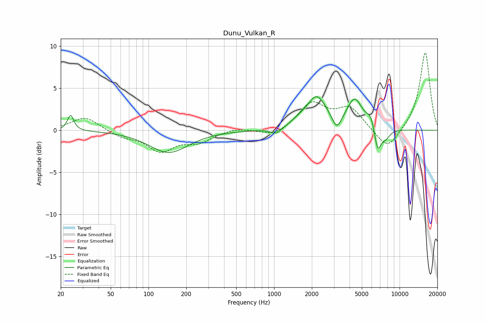

# Dunu_Vulkan_R
See [usage instructions](https://github.com/jaakkopasanen/AutoEq#usage) for more options and info.

### Parametric EQs
Apply preamp of -4.1 dB when using parametric equalizer.

|   # | Type    |   Fc (Hz) |    Q |   Gain (dB) |
|-----|---------|-----------|------|-------------|
|   1 | Peaking |        24 | 5.84 |         1.9 |
|   2 | Peaking |       145 | 0.91 |        -2.6 |
|   3 | Peaking |      1034 | 3.14 |        -0.8 |
|   4 | Peaking |      1570 | 2.45 |         0.4 |
|   5 | Peaking |      2187 | 1.77 |         3.8 |
|   6 | Peaking |      3162 | 3.89 |        -1.7 |
|   7 | Peaking |      4387 | 2.26 |         3.5 |
|   8 | Peaking |      5883 | 4.21 |         1.3 |
|   9 | Peaking |      6700 | 4.83 |        -3   |
|  10 | Peaking |      7767 | 3.87 |        -1   |

### Fixed Band EQs
When using fixed band (also called graphic) equalizer, apply preamp of **-9.3 dB** (if available) and set gains manually with these parameters.

|   # | Type    |   Fc (Hz) |    Q |   Gain (dB) |
|-----|---------|-----------|------|-------------|
|   1 | Peaking |        31 | 1.41 |         1.6 |
|   2 | Peaking |        62 | 1.41 |        -0.7 |
|   3 | Peaking |       125 | 1.41 |        -2.3 |
|   4 | Peaking |       250 | 1.41 |        -1.3 |
|   5 | Peaking |       500 | 1.41 |         0.3 |
|   6 | Peaking |      1000 | 1.41 |        -0.8 |
|   7 | Peaking |      2000 | 1.41 |         3.1 |
|   8 | Peaking |      4000 | 1.41 |         2.5 |
|   9 | Peaking |      8000 | 1.41 |        -2.5 |
|  10 | Peaking |     16000 | 1.41 |         9.4 |

### Graphs

