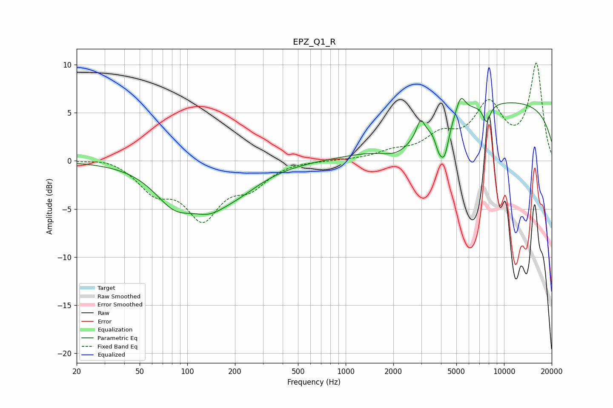

# EPZ_Q1_R
See [usage instructions](https://github.com/jaakkopasanen/AutoEq#usage) for more options and info.

### Parametric EQs
Apply preamp of -6.6 dB when using parametric equalizer.

|   # | Type    |   Fc (Hz) |    Q |   Gain (dB) |
|-----|---------|-----------|------|-------------|
|   1 | Peaking |        84 | 1.07 |        -3.8 |
|   2 | Peaking |       137 | 1.36 |        -2   |
|   3 | Peaking |       200 | 0.81 |        -2.6 |
|   4 | Peaking |      2152 | 1.26 |        -1.9 |
|   5 | Peaking |      2971 | 5.9  |         1.7 |
|   6 | Peaking |      3864 | 5.96 |        -1.5 |
|   7 | Peaking |      4204 | 4.61 |        -3.6 |
|   8 | Peaking |      5330 | 4.9  |         1.8 |
|   9 | Peaking |      7758 | 5.57 |        -1.9 |
|  10 | Peaking |     10000 | 0.19 |         6.1 |

### Fixed Band EQs
When using fixed band (also called graphic) equalizer, apply preamp of **-10.2 dB** (if available) and set gains manually with these parameters.

|   # | Type    |   Fc (Hz) |    Q |   Gain (dB) |
|-----|---------|-----------|------|-------------|
|   1 | Peaking |        31 | 1.41 |         0.4 |
|   2 | Peaking |        62 | 1.41 |        -2.8 |
|   3 | Peaking |       125 | 1.41 |        -5.5 |
|   4 | Peaking |       250 | 1.41 |        -2.3 |
|   5 | Peaking |       500 | 1.41 |         0.1 |
|   6 | Peaking |      1000 | 1.41 |         0.1 |
|   7 | Peaking |      2000 | 1.41 |         0.8 |
|   8 | Peaking |      4000 | 1.41 |         2.2 |
|   9 | Peaking |      8000 | 1.41 |         5.4 |
|  10 | Peaking |     16000 | 1.41 |         9.9 |

### Graphs

