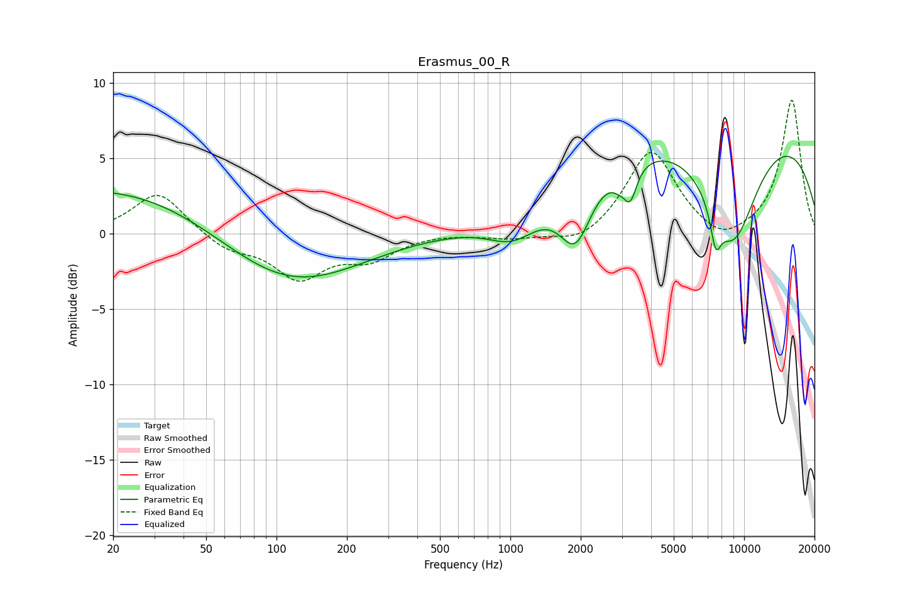

# Erasmus_00_R
See [usage instructions](https://github.com/jaakkopasanen/AutoEq#usage) for more options and info.

### Parametric EQs
Apply preamp of -5.2 dB when using parametric equalizer.

|   # | Type    |   Fc (Hz) |    Q |   Gain (dB) |
|-----|---------|-----------|------|-------------|
|   1 | Peaking |        20 | 0.3  |         3.1 |
|   2 | Peaking |        89 | 0.2  |         0.3 |
|   3 | Peaking |       111 | 0.47 |        -3.9 |
|   4 | Peaking |      1030 | 1.31 |        -1.8 |
|   5 | Peaking |      1902 | 2.08 |        -4   |
|   6 | Peaking |      2908 | 4.44 |        -0.6 |
|   7 | Peaking |      3256 | 4.94 |        -2.2 |
|   8 | Peaking |      7556 | 5.99 |        -2.4 |
|   9 | Peaking |      8456 | 0.18 |         7.7 |
|  10 | Peaking |      8922 | 1.12 |        -7.7 |

### Fixed Band EQs
When using fixed band (also called graphic) equalizer, apply preamp of **-9.0 dB** (if available) and set gains manually with these parameters.

|   # | Type    |   Fc (Hz) |    Q |   Gain (dB) |
|-----|---------|-----------|------|-------------|
|   1 | Peaking |        31 | 1.41 |         2.8 |
|   2 | Peaking |        62 | 1.41 |        -1   |
|   3 | Peaking |       125 | 1.41 |        -2.8 |
|   4 | Peaking |       250 | 1.41 |        -1.5 |
|   5 | Peaking |       500 | 1.41 |         0.1 |
|   6 | Peaking |      1000 | 1.41 |        -0.3 |
|   7 | Peaking |      2000 | 1.41 |        -0.9 |
|   8 | Peaking |      4000 | 1.41 |         5.6 |
|   9 | Peaking |      8000 | 1.41 |        -1   |
|  10 | Peaking |     16000 | 1.41 |         8.9 |

### Graphs

