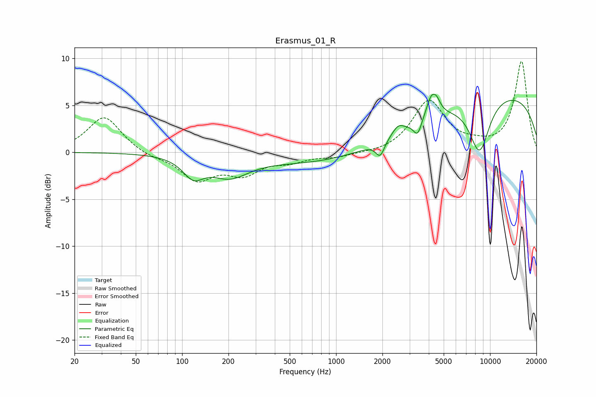

# Erasmus_01_R
See [usage instructions](https://github.com/jaakkopasanen/AutoEq#usage) for more options and info.

### Parametric EQs
Apply preamp of -6.3 dB when using parametric equalizer.

|   # | Type    |   Fc (Hz) |    Q |   Gain (dB) |
|-----|---------|-----------|------|-------------|
|   1 | Peaking |       118 | 2.09 |        -2   |
|   2 | Peaking |       203 | 1.16 |        -2.1 |
|   3 | Peaking |      1611 | 0.19 |        -1.6 |
|   4 | Peaking |      1934 | 4.94 |        -1.6 |
|   5 | Peaking |      2528 | 3.76 |         0.9 |
|   6 | Peaking |      3385 | 5.35 |        -1.6 |
|   7 | Peaking |      4149 | 4.32 |         2.1 |
|   8 | Peaking |      4509 | 5.58 |         1   |
|   9 | Peaking |      8537 | 1.95 |        -5.8 |
|  10 | Peaking |      9689 | 0.21 |         6.7 |

### Fixed Band EQs
When using fixed band (also called graphic) equalizer, apply preamp of **-9.8 dB** (if available) and set gains manually with these parameters.

|   # | Type    |   Fc (Hz) |    Q |   Gain (dB) |
|-----|---------|-----------|------|-------------|
|   1 | Peaking |        31 | 1.41 |         3.9 |
|   2 | Peaking |        62 | 1.41 |        -0.5 |
|   3 | Peaking |       125 | 1.41 |        -2.8 |
|   4 | Peaking |       250 | 1.41 |        -2   |
|   5 | Peaking |       500 | 1.41 |        -0.8 |
|   6 | Peaking |      1000 | 1.41 |        -0.5 |
|   7 | Peaking |      2000 | 1.41 |        -0.2 |
|   8 | Peaking |      4000 | 1.41 |         5.4 |
|   9 | Peaking |      8000 | 1.41 |         0.5 |
|  10 | Peaking |     16000 | 1.41 |         9.7 |

### Graphs

