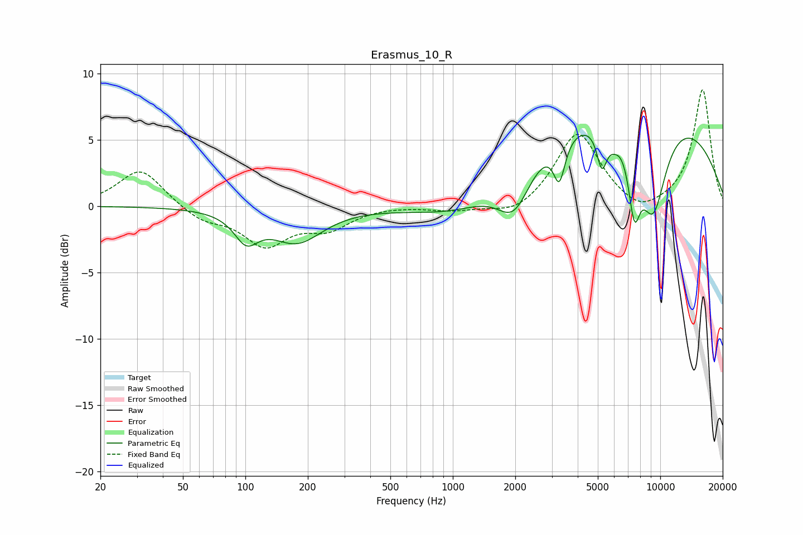

# Erasmus_10_R
See [usage instructions](https://github.com/jaakkopasanen/AutoEq#usage) for more options and info.

### Parametric EQs
Apply preamp of -5.4 dB when using parametric equalizer.

|   # | Type    |   Fc (Hz) |    Q |   Gain (dB) |
|-----|---------|-----------|------|-------------|
|   1 | Peaking |       101 | 2.47 |        -2.1 |
|   2 | Peaking |       177 | 1.14 |        -2.6 |
|   3 | Peaking |      1150 | 0.63 |        -2.1 |
|   4 | Peaking |      1976 | 1.7  |        -3.7 |
|   5 | Peaking |      3263 | 5.05 |        -3.1 |
|   6 | Peaking |      5234 | 5.53 |        -3   |
|   7 | Peaking |      5982 | 4.59 |        -0.7 |
|   8 | Peaking |      6969 | 0.22 |         8.1 |
|   9 | Peaking |      7497 | 4.54 |        -4.9 |
|  10 | Peaking |      9216 | 1.82 |        -7.5 |

### Fixed Band EQs
When using fixed band (also called graphic) equalizer, apply preamp of **-8.9 dB** (if available) and set gains manually with these parameters.

|   # | Type    |   Fc (Hz) |    Q |   Gain (dB) |
|-----|---------|-----------|------|-------------|
|   1 | Peaking |        31 | 1.41 |         2.9 |
|   2 | Peaking |        62 | 1.41 |        -1   |
|   3 | Peaking |       125 | 1.41 |        -2.8 |
|   4 | Peaking |       250 | 1.41 |        -1.5 |
|   5 | Peaking |       500 | 1.41 |         0.1 |
|   6 | Peaking |      1000 | 1.41 |        -0.3 |
|   7 | Peaking |      2000 | 1.41 |        -0.8 |
|   8 | Peaking |      4000 | 1.41 |         5.6 |
|   9 | Peaking |      8000 | 1.41 |        -1   |
|  10 | Peaking |     16000 | 1.41 |         8.8 |

### Graphs

