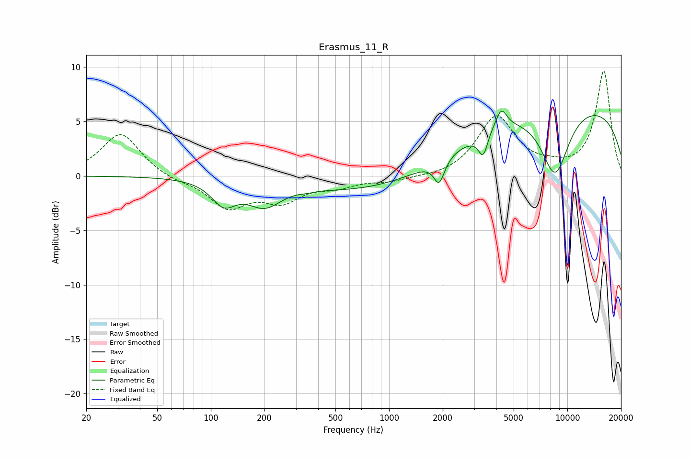

# Erasmus_11_R
See [usage instructions](https://github.com/jaakkopasanen/AutoEq#usage) for more options and info.

### Parametric EQs
Apply preamp of -6.1 dB when using parametric equalizer.

|   # | Type    |   Fc (Hz) |    Q |   Gain (dB) |
|-----|---------|-----------|------|-------------|
|   1 | Peaking |       118 | 2.09 |        -2.1 |
|   2 | Peaking |       200 | 1.47 |        -2.2 |
|   3 | Peaking |       349 | 3.75 |        -0.1 |
|   4 | Peaking |      1081 | 0.31 |        -1.9 |
|   5 | Peaking |      1910 | 4.79 |        -2.2 |
|   6 | Peaking |      3377 | 5.12 |        -2.2 |
|   7 | Peaking |      3680 | 5.65 |         0.2 |
|   8 | Peaking |      4260 | 4.51 |         1.8 |
|   9 | Peaking |      8529 | 1.62 |        -6.3 |
|  10 | Peaking |      9172 | 0.19 |         6.9 |

### Fixed Band EQs
When using fixed band (also called graphic) equalizer, apply preamp of **-9.7 dB** (if available) and set gains manually with these parameters.

|   # | Type    |   Fc (Hz) |    Q |   Gain (dB) |
|-----|---------|-----------|------|-------------|
|   1 | Peaking |        31 | 1.41 |         4   |
|   2 | Peaking |        62 | 1.41 |        -0.4 |
|   3 | Peaking |       125 | 1.41 |        -2.8 |
|   4 | Peaking |       250 | 1.41 |        -2.1 |
|   5 | Peaking |       500 | 1.41 |        -0.8 |
|   6 | Peaking |      1000 | 1.41 |        -0.5 |
|   7 | Peaking |      2000 | 1.41 |        -0.2 |
|   8 | Peaking |      4000 | 1.41 |         5.4 |
|   9 | Peaking |      8000 | 1.41 |         0.5 |
|  10 | Peaking |     16000 | 1.41 |         9.6 |

### Graphs

