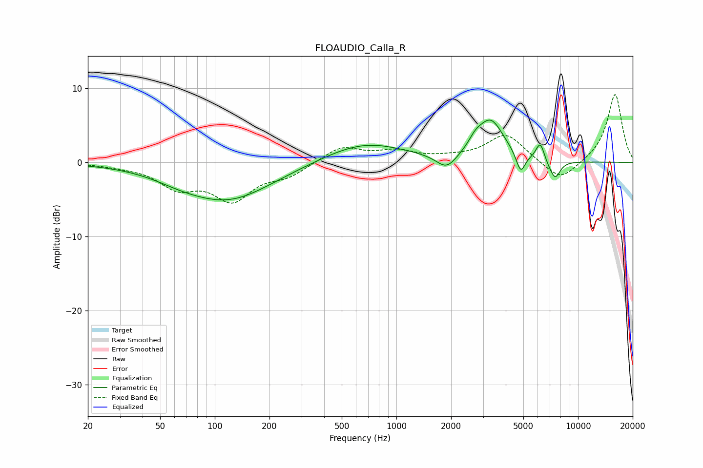

# FLOAUDIO_Calla_R
See [usage instructions](https://github.com/jaakkopasanen/AutoEq#usage) for more options and info.

### Parametric EQs
Apply preamp of -5.8 dB when using parametric equalizer.

|   # | Type    |   Fc (Hz) |    Q |   Gain (dB) |
|-----|---------|-----------|------|-------------|
|   1 | Peaking |        63 | 1.07 |        -0.6 |
|   2 | Peaking |       117 | 0.57 |        -5.1 |
|   3 | Peaking |       666 | 0.63 |         2.7 |
|   4 | Peaking |      1890 | 2.48 |        -2.1 |
|   5 | Peaking |      2718 | 3.88 |         1.1 |
|   6 | Peaking |      3302 | 1.9  |         5.5 |
|   7 | Peaking |      4833 | 5.57 |        -2.7 |
|   8 | Peaking |      6199 | 5.68 |         2.6 |
|   9 | Peaking |      6963 | 3.9  |        -0.6 |
|  10 | Peaking |      7502 | 4.85 |        -2.2 |

### Fixed Band EQs
When using fixed band (also called graphic) equalizer, apply preamp of **-9.2 dB** (if available) and set gains manually with these parameters.

|   # | Type    |   Fc (Hz) |    Q |   Gain (dB) |
|-----|---------|-----------|------|-------------|
|   1 | Peaking |        31 | 1.41 |        -0.3 |
|   2 | Peaking |        62 | 1.41 |        -3   |
|   3 | Peaking |       125 | 1.41 |        -4.7 |
|   4 | Peaking |       250 | 1.41 |        -1.6 |
|   5 | Peaking |       500 | 1.41 |         2.1 |
|   6 | Peaking |      1000 | 1.41 |         1.3 |
|   7 | Peaking |      2000 | 1.41 |         0.4 |
|   8 | Peaking |      4000 | 1.41 |         3.8 |
|   9 | Peaking |      8000 | 1.41 |        -2.8 |
|  10 | Peaking |     16000 | 1.41 |         9.3 |

### Graphs

