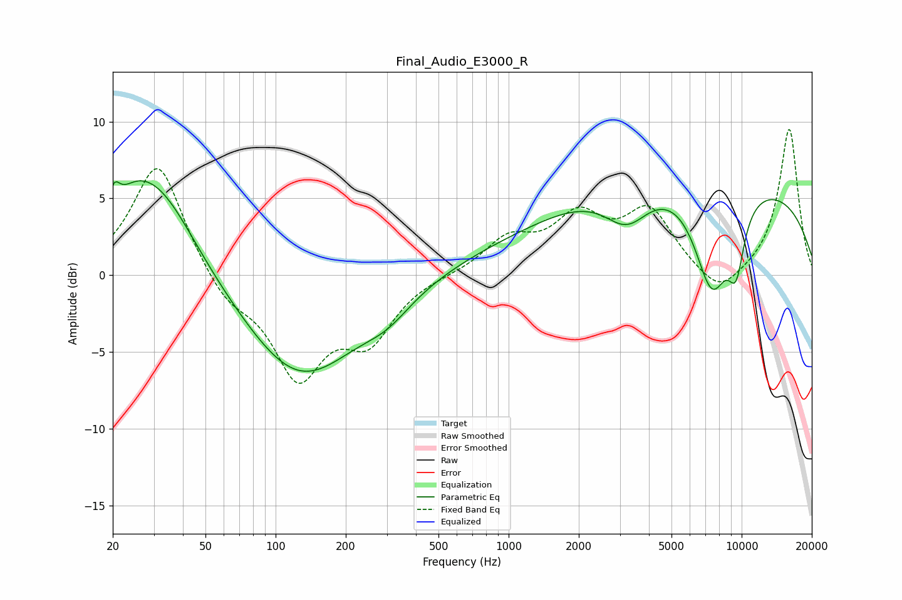

# Final_Audio_E3000_R
See [usage instructions](https://github.com/jaakkopasanen/AutoEq#usage) for more options and info.

### Parametric EQs
Apply preamp of -6.2 dB when using parametric equalizer.

|   # | Type    |   Fc (Hz) |    Q |   Gain (dB) |
|-----|---------|-----------|------|-------------|
|   1 | Peaking |        20 | 5.78 |         1.7 |
|   2 | Peaking |        24 | 1.62 |         1.7 |
|   3 | Peaking |        31 | 0.84 |         5.8 |
|   4 | Peaking |       128 | 0.57 |        -6.8 |
|   5 | Peaking |       302 | 1.34 |        -1.2 |
|   6 | Peaking |      2176 | 0.24 |         1.9 |
|   7 | Peaking |      3218 | 1.42 |        -2.7 |
|   8 | Peaking |      7454 | 1.67 |        -7.1 |
|   9 | Peaking |      8248 | 0.2  |         6.1 |
|  10 | Peaking |      9472 | 3.51 |        -3.6 |

### Fixed Band EQs
When using fixed band (also called graphic) equalizer, apply preamp of **-9.6 dB** (if available) and set gains manually with these parameters.

|   # | Type    |   Fc (Hz) |    Q |   Gain (dB) |
|-----|---------|-----------|------|-------------|
|   1 | Peaking |        31 | 1.41 |         7.5 |
|   2 | Peaking |        62 | 1.41 |        -1.8 |
|   3 | Peaking |       125 | 1.41 |        -6.3 |
|   4 | Peaking |       250 | 1.41 |        -3.8 |
|   5 | Peaking |       500 | 1.41 |         0   |
|   6 | Peaking |      1000 | 1.41 |         2.2 |
|   7 | Peaking |      2000 | 1.41 |         3.4 |
|   8 | Peaking |      4000 | 1.41 |         4   |
|   9 | Peaking |      8000 | 1.41 |        -1.7 |
|  10 | Peaking |     16000 | 1.41 |         9.6 |

### Graphs

