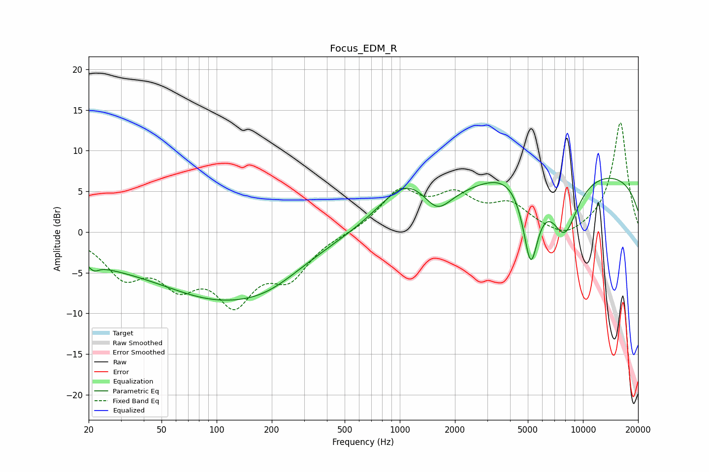

# Focus_EDM_R
See [usage instructions](https://github.com/jaakkopasanen/AutoEq#usage) for more options and info.

### Parametric EQs
Apply preamp of -6.7 dB when using parametric equalizer.

|   # | Type    |   Fc (Hz) |    Q |   Gain (dB) |
|-----|---------|-----------|------|-------------|
|   1 | Peaking |        21 | 5.46 |        -0.8 |
|   2 | Peaking |        21 | 0.55 |        -2   |
|   3 | Peaking |       103 | 0.38 |        -7.5 |
|   4 | Peaking |       193 | 0.84 |        -1.5 |
|   5 | Peaking |      1078 | 0.94 |         5   |
|   6 | Peaking |      1604 | 1.94 |        -2.8 |
|   7 | Peaking |      4552 | 0.75 |         2.6 |
|   8 | Peaking |      5184 | 3.03 |       -10.8 |
|   9 | Peaking |      7930 | 1.67 |        -7.6 |
|  10 | Peaking |      9904 | 0.18 |         7.6 |

### Fixed Band EQs
When using fixed band (also called graphic) equalizer, apply preamp of **-13.5 dB** (if available) and set gains manually with these parameters.

|   # | Type    |   Fc (Hz) |    Q |   Gain (dB) |
|-----|---------|-----------|------|-------------|
|   1 | Peaking |        31 | 1.41 |        -4.8 |
|   2 | Peaking |        62 | 1.41 |        -5.2 |
|   3 | Peaking |       125 | 1.41 |        -7.6 |
|   4 | Peaking |       250 | 1.41 |        -4.8 |
|   5 | Peaking |       500 | 1.41 |        -0.1 |
|   6 | Peaking |      1000 | 1.41 |         4.8 |
|   7 | Peaking |      2000 | 1.41 |         3.8 |
|   8 | Peaking |      4000 | 1.41 |         3   |
|   9 | Peaking |      8000 | 1.41 |        -1.3 |
|  10 | Peaking |     16000 | 1.41 |        13.6 |

### Graphs

