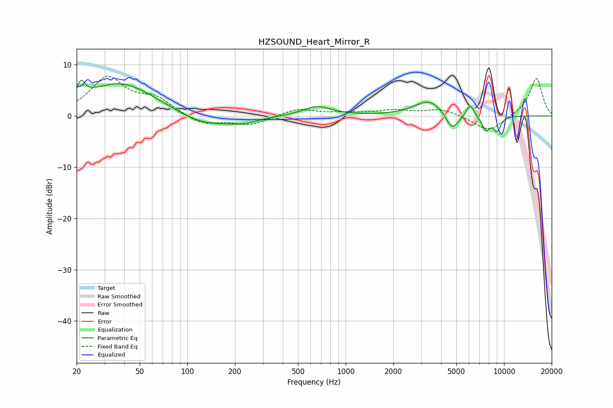

# HZSOUND_Heart_Mirror_R
See [usage instructions](https://github.com/jaakkopasanen/AutoEq#usage) for more options and info.

### Parametric EQs
Apply preamp of -7.0 dB when using parametric equalizer.

|   # | Type    |   Fc (Hz) |    Q |   Gain (dB) |
|-----|---------|-----------|------|-------------|
|   1 | Peaking |        21 | 5.95 |         2.9 |
|   2 | Peaking |        38 | 0.61 |         6.6 |
|   3 | Peaking |       127 | 0.8  |        -2.5 |
|   4 | Peaking |       229 | 1.63 |        -0.9 |
|   5 | Peaking |       661 | 1.57 |         1.9 |
|   6 | Peaking |      3383 | 1.5  |         3.2 |
|   7 | Peaking |      4705 | 3.32 |        -3.6 |
|   8 | Peaking |      6114 | 5.63 |         2.4 |
|   9 | Peaking |      7683 | 5.14 |        -2.8 |
|  10 | Peaking |      9032 | 5.39 |        -2.7 |

### Fixed Band EQs
When using fixed band (also called graphic) equalizer, apply preamp of **-7.9 dB** (if available) and set gains manually with these parameters.

|   # | Type    |   Fc (Hz) |    Q |   Gain (dB) |
|-----|---------|-----------|------|-------------|
|   1 | Peaking |        31 | 1.41 |         7.3 |
|   2 | Peaking |        62 | 1.41 |         3   |
|   3 | Peaking |       125 | 1.41 |        -1.8 |
|   4 | Peaking |       250 | 1.41 |        -1.8 |
|   5 | Peaking |       500 | 1.41 |         1.4 |
|   6 | Peaking |      1000 | 1.41 |         0.4 |
|   7 | Peaking |      2000 | 1.41 |         1   |
|   8 | Peaking |      4000 | 1.41 |         1.3 |
|   9 | Peaking |      8000 | 1.41 |        -3.1 |
|  10 | Peaking |     16000 | 1.41 |         7.5 |

### Graphs

