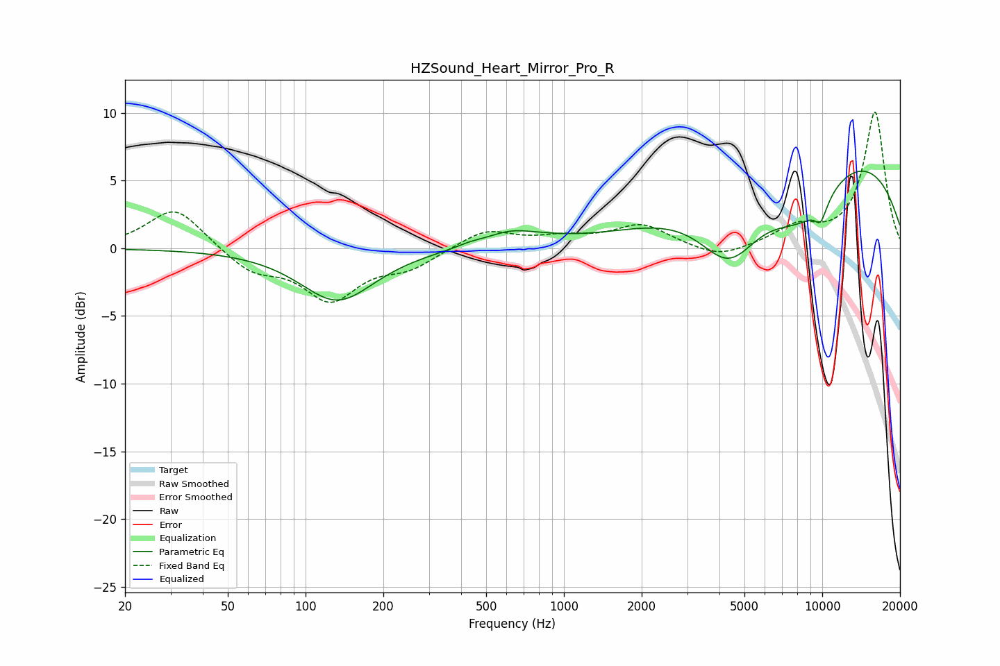

# HZSound_Heart_Mirror_Pro_R
See [usage instructions](https://github.com/jaakkopasanen/AutoEq#usage) for more options and info.

### Parametric EQs
Apply preamp of -5.8 dB when using parametric equalizer.

|   # | Type    |   Fc (Hz) |    Q |   Gain (dB) |
|-----|---------|-----------|------|-------------|
|   1 | Peaking |       133 | 0.99 |        -3.9 |
|   2 | Peaking |       430 | 3.02 |         0.2 |
|   3 | Peaking |       667 | 1.34 |         2   |
|   4 | Peaking |       698 | 1.64 |        -0.9 |
|   5 | Peaking |      4360 | 1.16 |        -5.2 |
|   6 | Peaking |      8265 | 0.91 |        -4.4 |
|   7 | Peaking |      9872 | 5.95 |        -1.1 |
|   8 | Peaking |      9879 | 0.25 |         7.8 |
|   9 | Peaking |     10000 | 5.75 |         0.6 |
|  10 | Peaking |     10000 | 4.05 |        -1   |

### Fixed Band EQs
When using fixed band (also called graphic) equalizer, apply preamp of **-10.1 dB** (if available) and set gains manually with these parameters.

|   # | Type    |   Fc (Hz) |    Q |   Gain (dB) |
|-----|---------|-----------|------|-------------|
|   1 | Peaking |        31 | 1.41 |         3.1 |
|   2 | Peaking |        62 | 1.41 |        -1.6 |
|   3 | Peaking |       125 | 1.41 |        -3.6 |
|   4 | Peaking |       250 | 1.41 |        -1.3 |
|   5 | Peaking |       500 | 1.41 |         1.4 |
|   6 | Peaking |      1000 | 1.41 |         0.6 |
|   7 | Peaking |      2000 | 1.41 |         1.7 |
|   8 | Peaking |      4000 | 1.41 |        -0.9 |
|   9 | Peaking |      8000 | 1.41 |         1.4 |
|  10 | Peaking |     16000 | 1.41 |        10.1 |

### Graphs

