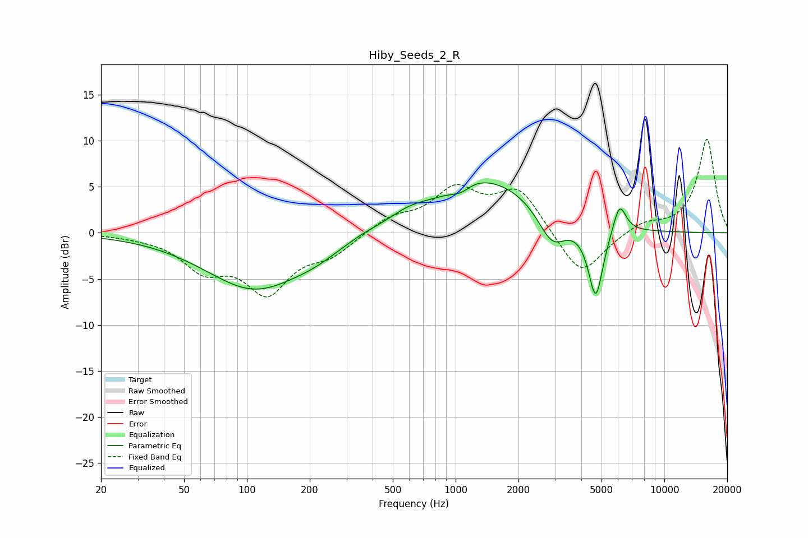

# Hiby_Seeds_2_R
See [usage instructions](https://github.com/jaakkopasanen/AutoEq#usage) for more options and info.

### Parametric EQs
Apply preamp of -5.5 dB when using parametric equalizer.

|   # | Type    |   Fc (Hz) |    Q |   Gain (dB) |
|-----|---------|-----------|------|-------------|
|   1 | Peaking |       109 | 0.59 |        -6.1 |
|   2 | Peaking |       212 | 1.27 |        -0.7 |
|   3 | Peaking |       357 | 2.06 |         0.3 |
|   4 | Peaking |       592 | 1.38 |         1.1 |
|   5 | Peaking |      1062 | 3.09 |        -0.7 |
|   6 | Peaking |      1225 | 2.17 |         0.4 |
|   7 | Peaking |      1465 | 0.57 |         5.7 |
|   8 | Peaking |      2899 | 2.09 |        -3.7 |
|   9 | Peaking |      4690 | 3.91 |        -7.9 |
|  10 | Peaking |      6099 | 4.41 |         3.3 |

### Fixed Band EQs
When using fixed band (also called graphic) equalizer, apply preamp of **-10.3 dB** (if available) and set gains manually with these parameters.

|   # | Type    |   Fc (Hz) |    Q |   Gain (dB) |
|-----|---------|-----------|------|-------------|
|   1 | Peaking |        31 | 1.41 |        -0.2 |
|   2 | Peaking |        62 | 1.41 |        -3.5 |
|   3 | Peaking |       125 | 1.41 |        -6   |
|   4 | Peaking |       250 | 1.41 |        -2   |
|   5 | Peaking |       500 | 1.41 |         1.6 |
|   6 | Peaking |      1000 | 1.41 |         4.4 |
|   7 | Peaking |      2000 | 1.41 |         4.6 |
|   8 | Peaking |      4000 | 1.41 |        -5   |
|   9 | Peaking |      8000 | 1.41 |         1.1 |
|  10 | Peaking |     16000 | 1.41 |        10.2 |

### Graphs

