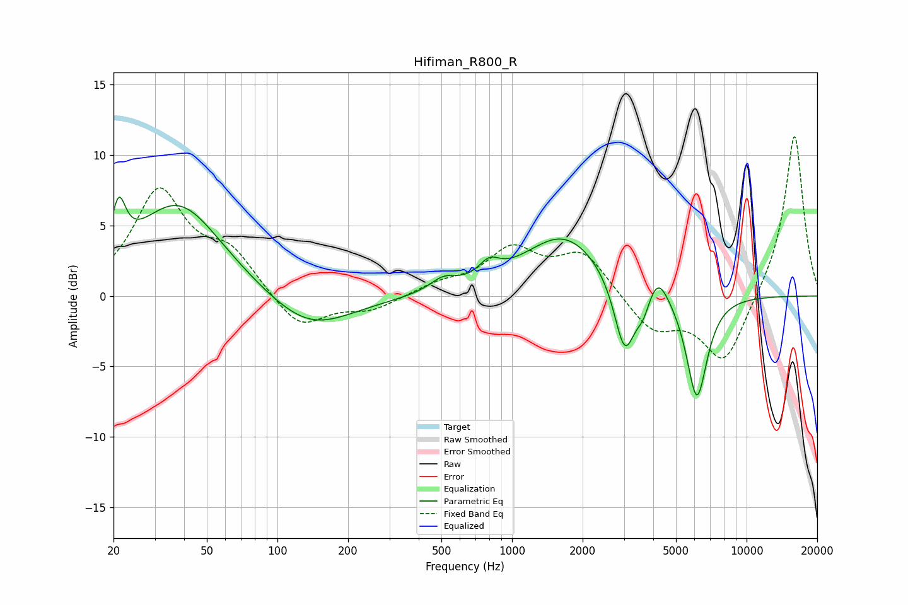

# Hifiman_R800_R
See [usage instructions](https://github.com/jaakkopasanen/AutoEq#usage) for more options and info.

### Parametric EQs
Apply preamp of -7.1 dB when using parametric equalizer.

|   # | Type    |   Fc (Hz) |    Q |   Gain (dB) |
|-----|---------|-----------|------|-------------|
|   1 | Peaking |        21 | 4.87 |         3.5 |
|   2 | Peaking |        38 | 0.75 |         6.6 |
|   3 | Peaking |       136 | 0.79 |        -2.6 |
|   4 | Peaking |       509 | 2.49 |         0.9 |
|   5 | Peaking |       799 | 3.2  |         1.1 |
|   6 | Peaking |      1668 | 0.82 |         4.3 |
|   7 | Peaking |      3022 | 3.15 |        -5.3 |
|   8 | Peaking |      3625 | 4.82 |        -1.3 |
|   9 | Peaking |      4185 | 3.17 |         1.9 |
|  10 | Peaking |      6137 | 3.07 |        -7.5 |

### Fixed Band EQs
When using fixed band (also called graphic) equalizer, apply preamp of **-11.4 dB** (if available) and set gains manually with these parameters.

|   # | Type    |   Fc (Hz) |    Q |   Gain (dB) |
|-----|---------|-----------|------|-------------|
|   1 | Peaking |        31 | 1.41 |         7.2 |
|   2 | Peaking |        62 | 1.41 |         2.8 |
|   3 | Peaking |       125 | 1.41 |        -2.5 |
|   4 | Peaking |       250 | 1.41 |        -1   |
|   5 | Peaking |       500 | 1.41 |         0.7 |
|   6 | Peaking |      1000 | 1.41 |         3.1 |
|   7 | Peaking |      2000 | 1.41 |         3   |
|   8 | Peaking |      4000 | 1.41 |        -2.4 |
|   9 | Peaking |      8000 | 1.41 |        -4.8 |
|  10 | Peaking |     16000 | 1.41 |        11.6 |

### Graphs

