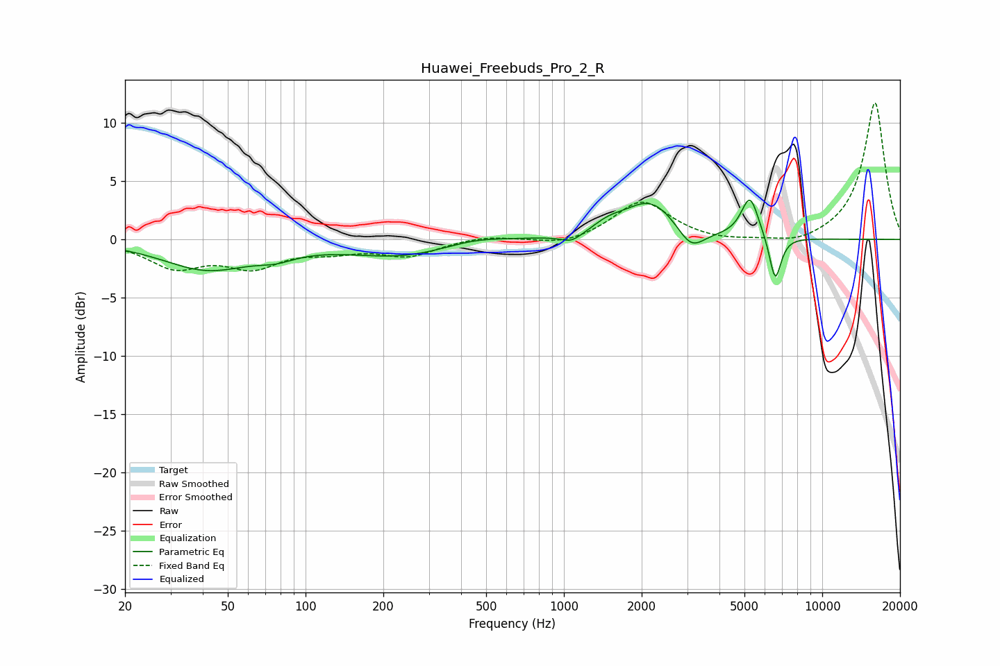

# Huawei_Freebuds_Pro_2_R
See [usage instructions](https://github.com/jaakkopasanen/AutoEq#usage) for more options and info.

### Parametric EQs
Apply preamp of -3.5 dB when using parametric equalizer.

|   # | Type    |   Fc (Hz) |    Q |   Gain (dB) |
|-----|---------|-----------|------|-------------|
|   1 | Peaking |        42 | 0.82 |        -2.5 |
|   2 | Peaking |        77 | 1.91 |        -0.6 |
|   3 | Peaking |       240 | 0.65 |        -1.5 |
|   4 | Peaking |       448 | 1.08 |         0.7 |
|   5 | Peaking |      1071 | 3.25 |        -0.8 |
|   6 | Peaking |      1482 | 2.46 |         0.6 |
|   7 | Peaking |      2165 | 1.31 |         3.3 |
|   8 | Peaking |      3104 | 2.64 |        -2   |
|   9 | Peaking |      5251 | 4.14 |         3.6 |
|  10 | Peaking |      6578 | 6    |        -3.9 |

### Fixed Band EQs
When using fixed band (also called graphic) equalizer, apply preamp of **-11.8 dB** (if available) and set gains manually with these parameters.

|   # | Type    |   Fc (Hz) |    Q |   Gain (dB) |
|-----|---------|-----------|------|-------------|
|   1 | Peaking |        31 | 1.41 |        -2.2 |
|   2 | Peaking |        62 | 1.41 |        -2.1 |
|   3 | Peaking |       125 | 1.41 |        -0.8 |
|   4 | Peaking |       250 | 1.41 |        -1.3 |
|   5 | Peaking |       500 | 1.41 |         0.4 |
|   6 | Peaking |      1000 | 1.41 |        -0.6 |
|   7 | Peaking |      2000 | 1.41 |         3.3 |
|   8 | Peaking |      4000 | 1.41 |        -0.3 |
|   9 | Peaking |      8000 | 1.41 |        -0.6 |
|  10 | Peaking |     16000 | 1.41 |        11.8 |

### Graphs

