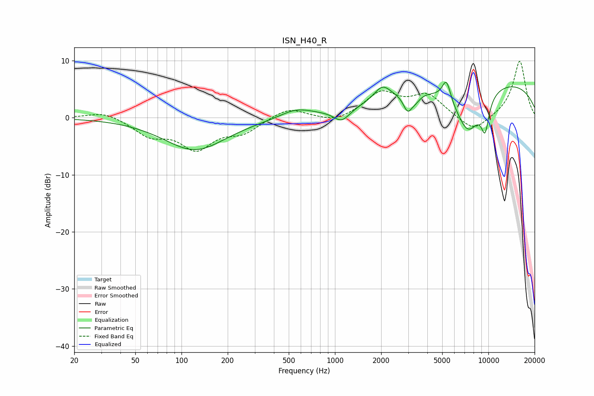

# ISN_H40_R
See [usage instructions](https://github.com/jaakkopasanen/AutoEq#usage) for more options and info.

### Parametric EQs
Apply preamp of -6.3 dB when using parametric equalizer.

|   # | Type    |   Fc (Hz) |    Q |   Gain (dB) |
|-----|---------|-----------|------|-------------|
|   1 | Peaking |       122 | 0.7  |        -5.7 |
|   2 | Peaking |       558 | 1.35 |         1.5 |
|   3 | Peaking |      1107 | 2.68 |        -2.2 |
|   4 | Peaking |      2038 | 2.6  |         2.6 |
|   5 | Peaking |      2979 | 4.84 |        -3   |
|   6 | Peaking |      3345 | 4.57 |        -1   |
|   7 | Peaking |      5327 | 5.09 |         3.7 |
|   8 | Peaking |      7362 | 1.5  |        -8.5 |
|   9 | Peaking |      9199 | 0.2  |         6.9 |
|  10 | Peaking |      9515 | 4.76 |        -5.4 |

### Fixed Band EQs
When using fixed band (also called graphic) equalizer, apply preamp of **-10.0 dB** (if available) and set gains manually with these parameters.

|   # | Type    |   Fc (Hz) |    Q |   Gain (dB) |
|-----|---------|-----------|------|-------------|
|   1 | Peaking |        31 | 1.41 |         1.2 |
|   2 | Peaking |        62 | 1.41 |        -2.8 |
|   3 | Peaking |       125 | 1.41 |        -5.1 |
|   4 | Peaking |       250 | 1.41 |        -2.3 |
|   5 | Peaking |       500 | 1.41 |         1.8 |
|   6 | Peaking |      1000 | 1.41 |        -1   |
|   7 | Peaking |      2000 | 1.41 |         4.2 |
|   8 | Peaking |      4000 | 1.41 |         3.8 |
|   9 | Peaking |      8000 | 1.41 |        -2.8 |
|  10 | Peaking |     16000 | 1.41 |        10   |

### Graphs

