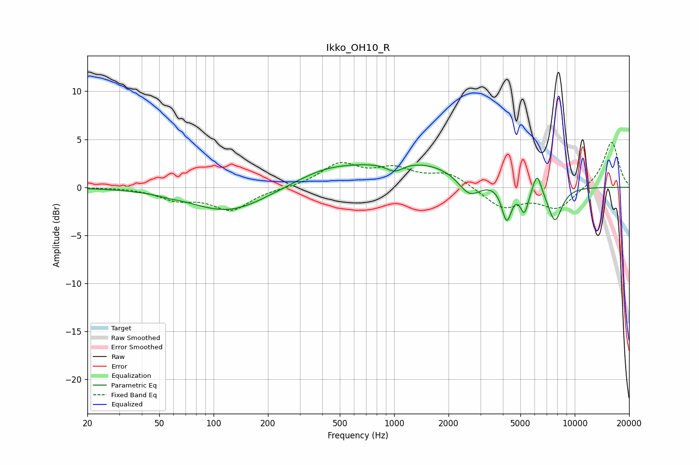

# Ikko_OH10_R
See [usage instructions](https://github.com/jaakkopasanen/AutoEq#usage) for more options and info.

### Parametric EQs
Apply preamp of -2.4 dB when using parametric equalizer.

|   # | Type    |   Fc (Hz) |    Q |   Gain (dB) |
|-----|---------|-----------|------|-------------|
|   1 | Peaking |        57 | 2.92 |        -0.1 |
|   2 | Peaking |       121 | 0.67 |        -2.6 |
|   3 | Peaking |       422 | 0.75 |         1.5 |
|   4 | Peaking |      1008 | 2.91 |        -1   |
|   5 | Peaking |      1344 | 0.46 |         2.6 |
|   6 | Peaking |      2617 | 2.18 |        -2.3 |
|   7 | Peaking |      4199 | 5.15 |        -3.7 |
|   8 | Peaking |      5262 | 5.95 |        -2.6 |
|   9 | Peaking |      6193 | 6    |         2.1 |
|  10 | Peaking |      7764 | 3.37 |        -3.7 |

### Fixed Band EQs
When using fixed band (also called graphic) equalizer, apply preamp of **-4.8 dB** (if available) and set gains manually with these parameters.

|   # | Type    |   Fc (Hz) |    Q |   Gain (dB) |
|-----|---------|-----------|------|-------------|
|   1 | Peaking |        31 | 1.41 |         0   |
|   2 | Peaking |        62 | 1.41 |        -1.1 |
|   3 | Peaking |       125 | 1.41 |        -2.3 |
|   4 | Peaking |       250 | 1.41 |        -0.1 |
|   5 | Peaking |       500 | 1.41 |         2.3 |
|   6 | Peaking |      1000 | 1.41 |         1.7 |
|   7 | Peaking |      2000 | 1.41 |         1.4 |
|   8 | Peaking |      4000 | 1.41 |        -2.1 |
|   9 | Peaking |      8000 | 1.41 |        -2.2 |
|  10 | Peaking |     16000 | 1.41 |         4.8 |

### Graphs

