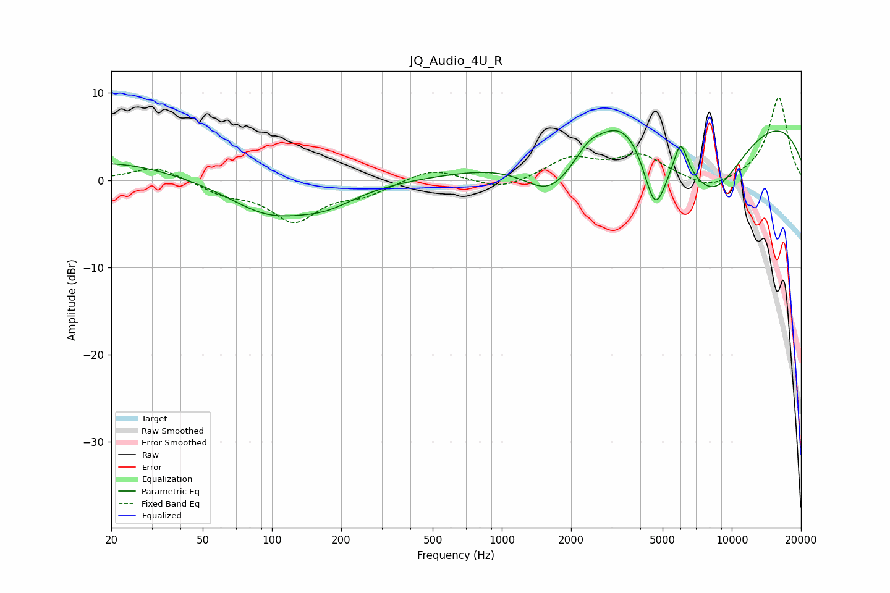

# JQ_Audio_4U_R
See [usage instructions](https://github.com/jaakkopasanen/AutoEq#usage) for more options and info.

### Parametric EQs
Apply preamp of -5.8 dB when using parametric equalizer.

|   # | Type    |   Fc (Hz) |    Q |   Gain (dB) |
|-----|---------|-----------|------|-------------|
|   1 | Peaking |        20 | 0.52 |         2.1 |
|   2 | Peaking |        96 | 0.81 |        -3.5 |
|   3 | Peaking |       172 | 1.05 |        -2   |
|   4 | Peaking |      1641 | 1.1  |        -6.3 |
|   5 | Peaking |      2373 | 3.32 |         0.8 |
|   6 | Peaking |      3477 | 1.16 |         2.7 |
|   7 | Peaking |      4633 | 2.48 |        -8.7 |
|   8 | Peaking |      5989 | 4.73 |         3.9 |
|   9 | Peaking |      7582 | 0.18 |        11.7 |
|  10 | Peaking |      8208 | 0.7  |       -12.1 |

### Fixed Band EQs
When using fixed band (also called graphic) equalizer, apply preamp of **-9.5 dB** (if available) and set gains manually with these parameters.

|   # | Type    |   Fc (Hz) |    Q |   Gain (dB) |
|-----|---------|-----------|------|-------------|
|   1 | Peaking |        31 | 1.41 |         1.7 |
|   2 | Peaking |        62 | 1.41 |        -1.4 |
|   3 | Peaking |       125 | 1.41 |        -4.5 |
|   4 | Peaking |       250 | 1.41 |        -1.4 |
|   5 | Peaking |       500 | 1.41 |         1.4 |
|   6 | Peaking |      1000 | 1.41 |        -1.2 |
|   7 | Peaking |      2000 | 1.41 |         2.4 |
|   8 | Peaking |      4000 | 1.41 |         2.7 |
|   9 | Peaking |      8000 | 1.41 |        -1.3 |
|  10 | Peaking |     16000 | 1.41 |         9.5 |

### Graphs

